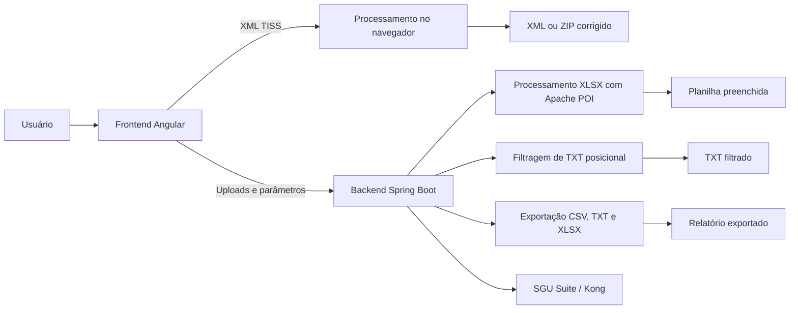

# Unimed Tools — Corretor de Arquivos

Aplicação interna desenvolvida para centralizar rotinas de correção, validação, transformação e exportação de arquivos utilizados pela Unimed Lorena.

O projeto reúne ferramentas para arquivos XML TISS, planilhas de BI, arquivos posicionais da ANS, consultas do SGU e futuras rotinas de fechamento de produção.

---

## Sumário

- [Visão geral](#visão-geral)
- [Status das páginas](#status-das-páginas)
- [Arquitetura](#arquitetura)
- [Tecnologias](#tecnologias)
- [Como cada página funciona](#como-cada-página-funciona)
  - [Página inicial](#1-página-inicial)
  - [Ferramentas XML TISS](#2-ferramentas-xml-tiss)
  - [BI — Especialidade Médica](#3-bi--especialidade-médica)
  - [Central de Relatórios](#4-central-de-relatórios)
  - [ANS — Corretor de Rede RPS](#5-ans--corretor-de-rede-rps)
  - [Fechamento de Produção](#6-fechamento-de-produção)
- [Estrutura do projeto](#estrutura-do-projeto)
- [Como executar localmente](#como-executar-localmente)
- [Variáveis de ambiente](#variáveis-de-ambiente)
- [Endpoints do backend](#endpoints-do-backend)
- [Deploy](#deploy)
- [Limitações conhecidas](#limitações-conhecidas)
- [Solução de problemas](#solução-de-problemas)
- [Segurança](#segurança)

---

## Visão geral

A aplicação é dividida em dois projetos:

- **Frontend Angular:** interface, navegação, upload de arquivos, visualização de resultados e downloads.
- **Backend Spring Boot:** processamento de planilhas e arquivos posicionais, integração com o SGU e geração de arquivos para exportação.

A página de XML é uma exceção importante: o processamento principal dos XMLs ocorre diretamente no navegador. As outras ferramentas utilizam o backend.

### Fluxo geral



---

## Status das páginas

| Página                     | Rota                       |                Status | Processamento                  |
| -------------------------- | -------------------------- | --------------------: | ------------------------------ |
| Login e MFA                | `/login`                   |            Disponível | Frontend + Backend + MariaDB   |
| Troca de senha             | `/alterar-senha`           |            Disponível | Frontend + Backend + MariaDB   |
| Cadastro de usuário        | `/usuarios/novo`           |    Somente administrador | Frontend + Backend + MariaDB |
| Gerenciamento de usuários  | `/usuarios`                |    Somente administrador | Frontend + Backend + MariaDB |
| Usuários cadastrados       | `/usuarios/cadastrados`    |    Somente administrador | Frontend + Backend + MariaDB |
| Permissões por usuário     | `/usuarios/permissoes`     |    Somente administrador | Frontend + Backend + MariaDB |
| Reset administrativo       | `/usuarios/resetar-senha`  |    Somente administrador | Frontend + Backend + MariaDB |
| Página inicial             | `/`                        |            Disponível | Frontend                       |
| Ferramentas XML TISS       | `/xml/ferramentas`         |            Disponível | Navegador                      |
| BI — Especialidade Médica  | `/bi/especialidade-medica` |            Disponível | Backend                        |
| Central de Relatórios      | `/relatorios`              | Disponível localmente | Backend + SGU                  |
| ANS — Corretor de Rede RPS | `/ans/corretor-rede`       |            Disponível | Backend                        |
| Fechamento de Produção     | `/fechamento/corretor`     |    Em desenvolvimento | Backend ainda não implementado |

### Situação atual da Central de Relatórios

A integração com o SGU funciona quando o backend é executado localmente. No ambiente hospedado no Render, o SGU/Kong atualmente retorna `HTTP 403 Forbidden`.

Isso indica uma restrição externa de IP, ACL, WAF ou autorização de origem. Até que o SGU/Kong libere o tráfego de saída do Render, a Central de Relatórios deve ser utilizada localmente.

---

## Arquitetura

### Frontend

O frontend utiliza componentes standalone do Angular e carregamento de páginas por rota.

**Atual:** `/login` é a única entrada pública da interface. Guards aguardam a
validação da sessão antes de liberar o layout, a troca da senha temporária é
obrigatória e cada página de módulo verifica a permissão recebida do backend.
Tokens de sessão não são armazenados em `localStorage` ou `sessionStorage`.

Principais responsabilidades:

- apresentar as ferramentas disponíveis;
- validar os arquivos selecionados;
- enviar arquivos ao backend;
- acompanhar progresso e mensagens;
- exibir estatísticas;
- gerar downloads;
- montar dinamicamente filtros e tabelas de relatórios;
- armazenar o catálogo pessoal de relatórios no navegador.
- exibir no topo o histórico de versões e manter localmente o estado de leitura
  das notificações.

**Atual:** o botão de notificações do cabeçalho lista as entregas da aplicação
com versão, data e resumo. Cada nova entrega funcional deve acrescentar uma
entrada ao histórico; abrir o painel marca as entradas atuais como lidas somente
naquele navegador.

Em desenvolvimento, o frontend usa um proxy:

```text
/api → http://localhost:8080
```

O proxy possui tempo limite de duas horas para permitir exportações extensas e é
carregado pelo comando `npm start`.

### Backend

O backend recebe requisições HTTP, processa arquivos e devolve os resultados para download.

**Atual:** o Spring Security nega acesso por padrão. A autenticação usa senha
com BCrypt, desafio TOTP obrigatório para administradores, sessão opaca em
cookie `HttpOnly`, proteção CSRF e autorização por permissão. O MariaDB persiste
somente o hash SHA-256 do token de sessão; o segredo TOTP é protegido com
AES-256-GCM usando uma chave externa ao banco.

Principais responsabilidades:

- ler e escrever planilhas XLSX;
- filtrar arquivos TXT posicionais;
- expor endpoints para análise e correção de XML;
- comunicar-se com a API do SGU;
- paginar relatórios;
- exportar relatórios completos em CSV, TXT e XLSX;
- devolver estatísticas por meio do header `X-Stats`.

### Limite de upload

O backend está configurado para aceitar requisições de até:

```text
100 MB
```

---

## Tecnologias

### Frontend

- Angular 21
- TypeScript 5.9
- RxJS 7.8
- SCSS
- npm

### Backend

- Java 21
- Spring Boot 3.3
- Spring Security 6.3
- MariaDB / MySQL com JDBC
- Maven
- Apache POI
- Apache Commons CSV
- Docker

### Infraestrutura utilizada

- GitHub para versionamento
- Vercel para o frontend
- Render para o backend
- SGU Suite/Kong para consultas externas

---

# Como cada página funciona

## 1. Página inicial

**Rota:** `/`

A página inicial apresenta os módulos da aplicação em cartões.

Cada cartão informa:

- nome da ferramenta;
- setor ou categoria;
- descrição;
- formatos aceitos;
- disponibilidade atual.

As ferramentas marcadas como disponíveis abrem sua respectiva página. Ferramentas ainda não concluídas aparecem como indisponíveis ou “Em breve”.

### Categorias exibidas

- XML — TISS
- BI — Business Intelligence
- Relatórios — Consultas SGU
- Fechamento — Produção
- ANS — Agência Nacional de Saúde Suplementar

A navegação interna também pode ser feita pelo menu lateral.

---

## 2. Ferramentas XML TISS

**Rota:** `/xml/ferramentas`

A página processa um ou vários arquivos XML TISS no próprio navegador.

Nenhum upload para o backend é necessário para o fluxo principal dessa página.

### Arquivos aceitos

```text
.xml
```

### Formas de envio

- seleção pelo explorador de arquivos;
- arrastar e soltar;
- processamento em lote de vários XMLs.

Arquivos com nomes repetidos não são adicionados novamente ao lote.

### Operações disponíveis

#### Todas as correções

Executa em conjunto:

- correção de prefixos;
- remoção de despesas zeradas;
- remoção de contêineres vazios;
- detecção e renomeação de guias duplicadas.

#### Corretor de prefixo

Localiza procedimentos com:

```xml
<ans:codigoTabela>00</ans:codigoTabela>
```

e remove os prefixos incorretos `18`, `19` ou `20` do início de:

```xml
<ans:codigoProcedimento>
```

Exemplo:

```xml
<ans:codigoProcedimento>1810101039</ans:codigoProcedimento>
```

é transformado em:

```xml
<ans:codigoProcedimento>10101039</ans:codigoProcedimento>
```

#### Removedor de blocos zerados

Localiza blocos:

```xml
<ans:despesa>...</ans:despesa>
```

e remove aqueles cujo:

```xml
<ans:valorTotal>
```

é igual a zero.

Também remove contêineres vazios nas formas:

```xml
<ans:outrasDespesas/>
```

ou:

```xml
<ans:outrasDespesas></ans:outrasDespesas>
```

#### Guias duplicadas

A ferramenta analisa os valores de:

```xml
<ans:numeroGuiaPrestador>
```

em todo o lote.

Quando o mesmo número aparece em mais de um arquivo, são adicionados sufixos sequenciais:

```text
12345a
12345b
12345c
```

### Resultado exibido

Para cada arquivo, a tela pode mostrar:

- prefixos encontrados e corrigidos;
- posição da ocorrência;
- valor original e valor final;
- blocos zerados removidos;
- data de execução;
- tabela e código do procedimento;
- descrição do procedimento;
- tags `outrasDespesas` vazias;
- linha e coluna da tag;
- número da guia relacionada;
- guias duplicadas e novos números.

A página também apresenta totais gerais do lote.

### Download

É possível baixar:

- um arquivo individual;
- todos os arquivos em ZIP.

As opções de nome são:

- ordem numérica: `1.xml`, `2.xml`, `3.xml`;
- nome original com sufixo: `arquivo_corrigido.xml`;
- nomes personalizados.

No download em lote, o arquivo padrão é:

```text
arquivos_xml_corrigidos.zip
```

### Observações

A lógica procura tags que utilizam o prefixo `ans:`. XMLs com estrutura ou namespace diferente podem não ser reconhecidos.

Sempre valide o arquivo corrigido antes de enviá-lo para produção.

---

## 3. BI — Especialidade Médica

**Rota:** `/bi/especialidade-medica`

Essa página preenche automaticamente a especialidade médica em uma planilha de despesas.

### Entradas

São necessários dois arquivos:

#### Planilha de despesas

Formato recomendado:

```text
.xlsx
```

A interface também permite selecionar CSV, mas o backend atual utiliza `XSSFWorkbook`. Portanto, o fluxo confiável e oficialmente suportado no momento é XLSX.

O sistema procura uma aba cujo nome contenha:

```text
despesa
```

Se nenhuma aba for encontrada, a primeira aba da planilha é utilizada.

#### Planilha de médicos

Formato:

```text
.xlsx
```

A primeira aba deve conter obrigatoriamente as colunas:

```text
PES_NOM_COMP
ESPMD_DES
```

### Colunas reconhecidas na planilha de despesas

#### Especialidade

Um destes nomes:

```text
NOME ESPECIALIDADE
NOME_ESPECIALIDADE
```

#### Solicitante ou prestador

Um destes nomes:

```text
NOME_PRESTADOR_SOLIC
NOME SOLICITANTE
NOME_SOLICITANTE
NOME_PRESTADOR
```

#### Código TUSS opcional

Um destes nomes:

```text
COD_TUSS
CODIGO_TUSS
```

### Regras de preenchimento

1. Linhas que já possuem especialidade não são alteradas.
2. Quando a especialidade está vazia, o sistema procura o nome do solicitante na planilha de médicos.
3. A comparação é feita com o texto sem diferenças entre maiúsculas e minúsculas.
4. Quando o solicitante está vazio, o sistema pode usar um mapa fixo de códigos TUSS.

### Mapa TUSS atual

| Código     | Especialidade  |
| ---------- | -------------- |
| `10101039` | CLÍNICA MÉDICA |
| `50000349` | FISIOTERAPIA   |
| `50000470` | PSICOLOGIA     |
| `50000560` | NUTRICIONISTA  |

### Estatísticas exibidas

Ao final, a página mostra:

- aba processada;
- total de linhas;
- especialidades preenchidas;
- linhas que já estavam preenchidas;
- linhas sem informação suficiente.

Esses dados são enviados pelo backend no header:

```text
X-Stats
```

### Saída

O backend sempre gera uma planilha XLSX com nome semelhante a:

```text
arquivo_PREENCHIDO.xlsx
```

---

## 4. Central de Relatórios

**Rota:** `/relatorios`

A Central de Relatórios permite cadastrar, localizar, executar, visualizar e exportar consultas publicadas como APIs no SGU.

**Status:** Atual e disponível no ambiente local.

A página oferece três modos:

- **Manual:** catálogo local de APIs do SGU, com filtros e exportação sob demanda;
- **Automático:** execução e exportação em lote dos grupos salvos no navegador;
- **Personalizado:** construtor guiado com filtros e colunas previamente autorizados pelo backend.

**Atual:** a permissão `RELATORIOS_ACESSAR` libera todos os modos e operações
da Central de Relatórios, inclusive importar SQL, criar, editar e excluir APIs
no SGU. Usuários sem essa permissão continuam sem acesso aos endpoints do
módulo.

**Atual:** nas prévias tabulares dos modos Manual e Personalizado, colunas que
representam Nome ou CPF do beneficiário são substituídas visualmente por uma
máscara. O modo Automático gera o lote diretamente e não apresenta prévia de
registros. A proteção é exclusiva da interface: os arquivos CSV, TXT, XLSX e ZIP
continuam recebendo os valores originais devolvidos pelo backend.

No modo Manual, a identificação é feita dinamicamente pelo nome da coluna e
também contempla aliases legados, como `PES_NOM_COMP`, `NM_PACIENTE`,
`BENEFICIARIO`, `NOME_COMP`, `NOME_COMPLETO` e qualquer coluna que contenha
`CPF`. Por isso, relatórios cadastrados antes desta versão recebem a proteção
sem precisar ser importados novamente.

No modo automático, a interface exibe uma evolução estimada enquanto o backend
consulta os itens e monta o ZIP. Como a exportação é uma única resposta HTTP e o
backend não envia eventos intermediários, o percentual fica limitado a 94% até a
chegada do arquivo; então muda para 100%, encerra o carregamento e informa a
conclusão ou a falha do lote.

### Relatório personalizado

**Status:** Atual.

O modo de relatório personalizado utiliza exclusivamente a API reservada:

```text
0090-relatorio-personalizado
```

A fonte atual é **Despesas por item de guia**. O catálogo controlado pelo
backend contém 50 colunas e 24 filtros, organizados nos grupos Beneficiário,
Contrato e empresa, Prestador, Guia, Procedimento, Valores e Período. As
competências inicial e final são obrigatórias e o intervalo aceita no máximo 12
meses. A prévia permite 25, 50 ou 100 linhas por página, aceita os metadados de
contagem `totalElements` ou `numberOfElements` informados pelo SGU, possui
cabeçalho fixo, numeração das linhas e modo ampliado; a exportação percorre todas
as páginas e gera CSV, TXT ou XLSX apenas com as colunas selecionadas e na ordem
definida pelo usuário.

O filtro opcional **Grupo do beneficiário** aceita o código funcional
`DBAUNIMED.GRUPO_BNFRIO.GRBNF_COD` ou parte da descrição `GRBNF_DES`, sem
diferença entre maiúsculas e minúsculas. O campo técnico `ID` não participa da
filtragem. As associações de
`DBAUNIMED.GRUPO_BNFRIO_ITEM` são consolidadas pelas quatro partes da chave do
beneficiário antes da filtragem. Cada uma dessas partes é comparada diretamente
com a chave registrada em `DBAUNIMED.GUIA` — Unimed responsável, contrato,
beneficiário e dependente — sem depender da associação intermediária com
`BNFRIO`. Esse relacionamento só é incluído no SQL quando o filtro está
preenchido e não multiplica as linhas de beneficiários que participam de mais de
um grupo.

Quando a seleção contém ao menos uma coluna de **Beneficiário**, ao menos uma
coluna de **Valores** e nenhuma coluna dos demais grupos, os valores são
automaticamente somados por beneficiário no período consultado. A identidade
do beneficiário gravada na guia, com suas quatro partes, permanece como chave
técnica do agrupamento mesmo quando o código não é exibido. Ao selecionar uma
coluna de contrato, prestador, guia ou procedimento, a consulta preserva o
detalhamento por item.

Fluxo atual:

1. o frontend solicita ao backend os rótulos, tipos, grupos, limites e marcações
   de dados sensíveis;
2. o usuário informa os filtros, escolhe ao menos uma coluna e organiza a ordem
   de saída;
3. o backend valida a allowlist de campos, tipos, intervalos e paginação;
4. o SQL é montado somente com expressões aprovadas no código;
5. a definição é publicada na API reservada e executada no SGU;
6. a resposta é projetada novamente no backend para devolver somente as
   colunas solicitadas;
7. a interface apresenta a prévia ou baixa a exportação completa.

O usuário pode marcar **Remover linhas duplicadas**. Essa opção acrescenta
`DISTINCT` ao `SELECT` externo aprovado pelo backend e considera a combinação de
todas as colunas selecionadas. Para obter uma guia uma única vez, devem ser
selecionadas somente as colunas que identificam a guia; campos de item ou outros
valores diferentes continuam produzindo linhas diferentes.

A cada execução, o backend monta a consulta somente com colunas e filtros do
catálogo aprovado. A API é publicada no SGU na primeira consulta e sempre que a
estrutura mudar; paginações ou repetições idênticas reutilizam a definição já
publicada para evitar uma chamada administrativa desnecessária. Em seguida, o
backend executa a consulta. Os identificadores usados entre Angular e Spring
Boot permanecem com underscore, como `competencia_inicio`. Na fronteira HTTP
com o SGU, o backend remove os separadores e envia um identificador alfanumérico
em minúsculas, como `competenciainicio`. O mesmo identificador é utilizado no bind
`:competenciainicio`: ele não contém o underscore rejeitado pelo SGU nem o hífen
inválido em parâmetros nomeados do Oracle. `nomeFiltro`, `conteudoFiltro` e os
parâmetros de execução ficam, portanto, com exatamente o mesmo nome, sem
comentários ou condições artificiais no SQL. O backend continua aceitando IDs
com underscore ou hífen na requisição para preservar compatibilidade, mas nunca
monta fragmentos SQL enviados pelo usuário.

A consulta publicada calcula os campos filtráveis em uma consulta interna. O
marcador `/*FILTROS*/` fica no `WHERE` da consulta externa e cada
`conteudoFiltro` usa somente o alias calculado, um operador e o bind compacto,
por exemplo `and RP.F_CODIGO_BENEFICIARIO = :codigobeneficiario`. Funções,
expressões `CASE`, normalização de texto e formatação não são enviadas no
`conteudoFiltro`: os cálculos permanecem no SQL-base aprovado e os valores de
busca são normalizados pelo backend. Aliases técnicos usados na filtragem e na
ordenação não são devolvidos ao navegador.

A API reservada não aparece na listagem do catálogo manual e não pode ser
alterada, executada ou removida pelos endpoints genéricos. Como ela é um
recurso mutável compartilhado no SGU, o backend usa um lock durante publicação,
execução e exportação. A última definição publicada também fica em cache na
memória do processo: uma mudança nas colunas ou nos filtros ativos republica a
API; uma nova página com a mesma estrutura reutiliza a definição existente.

Validações atuais do construtor:

- pelo menos uma coluna autorizada deve ser selecionada;
- competência usa `AAAAMM`, possui mês válido e intervalo máximo de 12 meses;
- datas inicial e final precisam formar um intervalo válido;
- valor máximo não pode ser menor que o mínimo;
- filtros numéricos e decimais são convertidos no backend;
- CPF, código de beneficiário, código de grupo, CID e buscas textuais são normalizados
  antes da integração;
- filtros desconhecidos, duplicados ou acima de 240 caracteres são rejeitados;
- nomes de arquivo são sanitizados antes do download.

Após a exportação personalizada, o backend envia a quantidade efetivamente
gravada no header `X-Total-Registros`, exposto pelo CORS para que a interface
mostre o total de linhas geradas.

No frontend Angular sem Zone.js, o componente solicita explicitamente a
atualização da view ao iniciar e concluir a chamada HTTP. Assim, o indicador de
carregamento, a tabela, a paginação e as mensagens aparecem automaticamente
quando a resposta chega, sem depender de redimensionamento ou abertura do F12.

### Dependências

Para funcionar, são necessários:

- backend Spring Boot em execução;
- acesso à API do SGU;
- API key válida;
- permissão do SGU/Kong para o IP de origem do backend.

### Catálogo local

Os relatórios adicionados à interface são armazenados no navegador por meio do `localStorage`.

Chave utilizada:

```text
unimed-tools.relatorios.v1
```

Isso significa que:

- o catálogo é específico de cada navegador;
- limpar os dados do navegador remove o catálogo local;
- adicionar um relatório em um computador não o adiciona automaticamente em outro;
- a API continua existindo no SGU mesmo que o item seja removido apenas do catálogo local.

### Adicionar uma API existente

1. Clique em **Novo relatório**.
2. Escolha **Usar API existente**.
3. Informe o nome cadastrado no SGU.
4. Faça a busca.
5. Informe o nome de exibição e uma descrição opcional.
6. Salve no catálogo.

O backend chama:

```text
lista_query_api
```

para localizar a definição e os filtros da API.

### Criar uma nova API

A página também permite cadastrar uma consulta no SGU.

São informados:

- nome da API;
- nome de exibição;
- descrição;
- SQL;
- ordenação;
- filtros.

Na importação de arquivos `.sql` ou `.txt`, a aplicação também reconhece
filtros dentro de CTEs. Quando uma CTE usa duas ou mais ocorrências da mesma
data no formato `TO_DATE('DD/MM/AAAA', 'DD/MM/YYYY')`, todas são substituídas
por um único filtro obrigatório `data_referencia`. Listas vazias de empresas ou
itens, como `emp.empcn_cod_pessoa IN ()`, são convertidas em filtros de lista
obrigatórios dentro da própria CTE. Datas diferentes permanecem fixas para que a
aplicação não altere silenciosamente o intervalo da consulta.

Listas `IN` simples no `WHERE`, tanto externo quanto de CTE, são reconhecidas
para identificadores de coluna genéricos. Igualdades só são promovidas a filtro
quando a coluna pertence ao conjunto conhecido de competência, grupo, empresa,
Unimed ou item. Assim, `GRBNF_COD IN (1)` e
`GUIA_NRO_COMPET IN (202605)` viram filtros editáveis, enquanto constantes
técnicas como `RN = 1` e `GUITE_IND_STATUS = 'I'` permanecem fixas no SQL.
Expressões, subconsultas e operadores ambíguos também não são reescritos
automaticamente.

Quando o arquivo contém anotações ou consultas auxiliares depois do ponto e
vírgula da consulta principal, somente a primeira instrução é importada. Pontos
e vírgulas dentro de textos ou comentários são preservados e não encerram a
leitura. Comentários que aparecem somente depois do último token executável
também são descartados antes do cadastro, para que o marcador `/*FILTROS*/`
permaneça no SQL executável. Comentários internos continuam preservados, e
delimitadores de comentário ou aspas sem fechamento impedem o envio ao SGU com
uma mensagem que indica a linha de abertura.

Antes do cadastro, a aplicação também verifica aliases de tabela repetidos no
mesmo bloco `SELECT` e informa o alias e as linhas conflitantes. O mesmo nome
pode continuar sendo reutilizado em CTEs ou subconsultas diferentes. Rejeições
de validação devolvidas pelo SGU são apresentadas como erro de solicitação; se o
retorno contiver um código Oracle, somente o código é preservado, sem expor o
SQL enviado.

Aliases de colunas de saída também precisam ser únicos dentro de cada `SELECT`.
O SGU envolve a consulta para aplicar paginação, e nomes repetidos podem causar
`ORA-00918` somente durante a execução. A importação identifica esse conflito
antes do cadastro e informa as linhas que precisam ser renomeadas.

A criação utiliza:

```text
ins_atu_query_api
```

### Regras dos filtros

O nome do filtro deve:

- estar em minúsculo;
- não conter espaços;
- usar apenas letras, números, underscore ou hífen na edição interna da aplicação.

Antes do envio ao SGU, underscores e hífens são removidos do `nomeFiltro` e do
bind correspondente no SQL. Por exemplo, `data_referencia` é enviado como
`datareferencia` e `:datareferencia`. A compactação evita o underscore rejeitado
pelo SGU sem criar binds Oracle inválidos com hífen. Colisões entre dois nomes
que resultariam no mesmo identificador compactado são rejeitadas antes do
cadastro.

Exemplo:

```text
competencia
```

O conteúdo precisa começar exatamente com:

```text
and
```

em letras minúsculas.

Também precisa conter o parâmetro com dois-pontos:

```text
:competencia
```

Tipos aceitos:

```text
NUMBER
DATE
VARCHAR(tamanho)
```

Exemplo:

```json
{
  "nomeFiltro": "competencia",
  "conteudoFiltro": "and G.GUIA_NRO_COMPET = :competencia",
  "tipoDadoFiltro": "NUMBER",
  "mascaraFiltro": "",
  "obrigatorioFiltro": "S"
}
```

Para filtros com vários códigos separados por vírgula, utilize `VARCHAR`, não `NUMBER`.

### Gerar relatório

Ao selecionar um relatório:

1. a tela monta automaticamente os campos;
2. os filtros obrigatórios são validados;
3. filtros `NUMBER` são enviados como número;
4. filtros `DATE` e `VARCHAR` são enviados como texto;
5. o backend acrescenta `page` e `size`;
6. o SGU retorna os registros;
7. a tabela é criada dinamicamente com base nas colunas da resposta.

O usuário pode escolher:

```text
25, 50 ou 100 linhas por página
```

### Exportações

Formatos disponíveis:

- CSV;
- TXT;
- XLSX.

A exportação não utiliza somente a página visível. O backend percorre as páginas
do SGU até obter o relatório completo. Por padrão não existe teto fixo de
páginas; ainda são interrompidas APIs que repetem a mesma página indefinidamente.
Se a operação precisar de um limite operacional, ele pode ser definido pela
variável `SGU_EXPORT_MAX_PAGES`.

**Status: Atual.** No modo Manual, o backend processa uma página do SGU por vez
e transmite o arquivo diretamente na resposta, sem manter todas as linhas e uma
cópia integral do arquivo simultaneamente na memória. CSV e TXT são liberados a
cada página; XLSX utiliza a escrita temporária em disco do Apache POI e grava o
arquivo final diretamente na resposta. A operação assíncrona aceita por padrão
até duas horas, configuráveis por `REPORT_EXPORT_ASYNC_TIMEOUT_MS`.

Nos modos Manual e Personalizado, uma barra apresenta o progresso estimado da
consulta ou da montagem do arquivo e passa a acompanhar a transferência HTTP
quando o tamanho total é informado. A coluna técnica `RNUM`, usada pelo SGU na
paginação, é descartada pelo gerador comum e não aparece em CSV, TXT, XLSX ou
arquivos incluídos no ZIP automático.

**Status: Atual.** As conclusões assíncronas dos modos Manual, Personalizado e
Automático notificam explicitamente a detecção de mudanças do Angular. Listagem,
cadastro, edição, exclusão, consulta, exportação, progresso, sucesso e erro são
refletidos imediatamente na tela, sem depender de um clique posterior do usuário.

#### CSV

- codificação UTF-8;
- BOM para facilitar abertura no Excel;
- separador `;`.
- datas são normalizadas como `DD/MM/AAAA`;
- valores decimais usam vírgula como separador decimal;
- campos textuais potencialmente interpretados como fórmula são neutralizados.

#### TXT

- codificação UTF-8;
- BOM;
- colunas separadas por `;`, com proteção para valores que contenham o próprio
  separador;
- datas e valores decimais seguem a mesma representação do CSV;
- campos textuais potencialmente interpretados como fórmula são neutralizados.

#### XLSX

- cabeçalho em destaque;
- primeira linha congelada;
- filtro automático;
- colunas com largura ajustada ao conteúdo, limitada a 60 caracteres;
- células gravadas com tipo e formato de texto, número inteiro, decimal ou data;
- códigos, documentos, guias, contratos, competências e outros identificadores
  permanecem como texto para preservar zeros à esquerda;
- geração por workbook de streaming.

O XLSX é o formato indicado quando a tipagem das células precisa ser preservada.
CSV e TXT são formatos textuais e, por definição, não armazenam tipos de coluna;
nesses formatos a aplicação normaliza a representação para facilitar a importação
no Excel, mas o resultado final ainda depende das opções de importação e da
configuração regional do programa.

### Remover relatório

Há duas opções:

- remover apenas do catálogo do navegador;
- remover do catálogo e também apagar a API no SGU.

A exclusão no SGU utiliza:

```text
apaga_query_api
```

### Limitação atual no Render

A mesma API key retorna sucesso em chamadas locais, mas o SGU/Kong responde `403 Forbidden` quando a requisição se origina no Render.

O código do frontend e do backend não deve tentar contornar essa restrição.

As soluções possíveis são:

- liberar no SGU/Kong os IPs de saída do Render;
- utilizar hospedagem com IP fixo autorizado;
- utilizar proxy com IP autorizado;
- executar o backend dentro da rede corporativa;
- continuar utilizando o módulo localmente.

---

## 5. ANS — Corretor de Rede RPS

**Rota:** `/ans/corretor-rede`

Essa página remove linhas de um TXT posicional com base em registros de erro fornecidos pela ANS.

### Entradas obrigatórias

- um arquivo TXT posicional;
- pelo menos uma fonte de erros.

### Modos disponíveis

#### Planilha XLSX com múltiplas abas

Envie:

- uma planilha XLSX;
- o arquivo TXT que será filtrado.

Abas reconhecidas:

```text
ECnes
CNES
Municpio
Municipio
Prestador
Aviso
Erros
erros_*
misto*
```

As abas `Erros` podem conter mensagens em texto livre. O backend tenta identificar automaticamente o tipo de ocorrência.

#### Arquivos individuais

É possível fornecer arquivos separados para:

- ECnes;
- CNES;
- Município;
- Prestador;
- Aviso.

Todos são opcionais individualmente, mas pelo menos um deve ser informado junto com o TXT.

### Critérios de filtragem

#### ECnes

Remove por:

```text
CNPJ/CPF
```

#### CNES

Remove pela combinação:

```text
CNPJ/CPF + CNES
```

#### Município

Remove pela combinação:

```text
CNPJ/RAZÃO + CNES
```

#### Prestador — erro 8521

Pode remover por:

- combinação exata de CNPJ e CNES;
- somente CNPJ, quando o CNES está vazio, funcionando como curinga.

#### Aviso

Remove pelo CNES.

### Estrutura do TXT

O backend lê o arquivo com codificação:

```text
ISO-8859-1
```

Posições utilizadas:

| Informação | Posição inicial | Posição final exclusiva |
| ---------- | --------------: | ----------------------: |
| CNPJ       |               0 |                      14 |
| CNES 1     |              94 |                     101 |
| CNES 2     |             109 |                     116 |

O sistema completa:

- CNPJ com zeros à esquerda até 14 posições;
- CNES com zeros à esquerda até 7 posições.

### Resultado

A página exibe:

- quantidade de chaves carregadas por categoria;
- linhas lidas;
- linhas removidas;
- linhas mantidas;
- log da execução.

As estatísticas chegam pelo header:

```text
X-Stats
```

### Saída

```text
nome_original_filtrado.txt
```

O arquivo de saída mantém a codificação ISO-8859-1.

---

## 6. Fechamento de Produção

**Rota:** `/fechamento/corretor`

A interface dessa página foi preparada para converter uma planilha de eventos em CSV para fechamento de produção.

### Fluxo previsto

1. selecionar uma planilha XLSX;
2. enviar o arquivo ao backend;
3. acompanhar o progresso;
4. receber o arquivo convertido;
5. baixar como:

```text
nome_original_convertido.csv
```

### Endpoint previsto

```text
POST /api/fechamento/converter
```

### Status atual

O cartão está marcado como não disponível na página inicial e no menu lateral.

O frontend existe, mas o backend atual não contém um controller ou serviço para `fechamento/converter`. Portanto, essa página deve ser considerada **em desenvolvimento**.

---

## Estrutura do projeto

```text
corretor-de-arquivos/
├── unimed-tools-frontend/             # Frontend Angular
│   ├── public/
│   ├── src/
│   │   ├── app/
│   │   │   ├── layout/
│   │   │   │   ├── main-layout/
│   │   │   │   └── sidebar/
│   │   │   ├── pages/
│   │   │   │   ├── home/
│   │   │   │   ├── xml/
│   │   │   │   ├── bi/
│   │   │   │   ├── relatorios/
│   │   │   │   ├── ans/
│   │   │   │   └── fechamento/
│   │   │   ├── shared/
│   │   │   │   ├── components/
│   │   │   │   ├── models/
│   │   │   │   └── services/
│   │   │   └── app.routes.ts
│   │   ├── environments/
│   │   ├── main.ts
│   │   └── styles.scss
│   ├── angular.json
│   ├── package.json
│   └── proxy.conf.json
│
├── unimed-tools-backend/              # Backend Spring Boot
│   ├── src/main/java/com/unimedlorena/tools/
│   │   ├── controller/
│   │   ├── auth/
│   │   ├── dto/
│   │   ├── service/
│   │   ├── config/
│   │   ├── exception/
│   │   └── UnimedToolsApplication.java
│   ├── src/main/resources/
│   │   └── application.properties
│   ├── Dockerfile
│   └── pom.xml
│
├── database/
│   ├── DBUNIMED.sql                    # Esquema completo atual
│   └── README.md                       # Instalação e privilégios do banco
│
├── docs/
│   └── ARQUITETURA.md                  # Fronteiras e responsabilidades técnicas
│
├── .gitignore
├── AGENTS.md                           # Orientações para agentes de IA
├── SEGURANCA.md               # Política de desenvolvimento seguro e privacidade
├── PADRAO_DE_COMMITS.md                # Conventional Commits do projeto
├── render.yaml
└── README.md
```

---

## Como executar localmente

### Pré-requisitos

Instale:

- Git;
- Node.js compatível com o Angular 21;
- npm;
- Java 21;
- Maven 3.9 ou superior.
- XAMPP com MariaDB/MySQL e phpMyAdmin;
- aplicativo autenticador compatível com TOTP para contas administrativas.

### 1. Clonar o projeto

```bash
git clone https://github.com/HeitorLeite/Unimed-Tools.git
cd corretor-de-arquivos
```

### 2. Preparar o banco e o primeiro administrador

1. Importe [`database/DBUNIMED.sql`](database/DBUNIMED.sql) no phpMyAdmin.
2. Siga [`database/README.md`](database/README.md) para criar uma conta de banco
   exclusiva da aplicação.
3. Gere uma chave aleatória de 32 bytes para proteger os segredos TOTP:

```powershell
$authKeyBytes = New-Object byte[] 32
[Security.Cryptography.RandomNumberGenerator]::Fill($authKeyBytes)
$env:AUTH_MFA_ENCRYPTION_KEY=[Convert]::ToBase64String($authKeyBytes)
```

4. Antes da primeira execução, defina o acesso ao banco e a conta inicial:

```powershell
$env:DB_USERNAME="unimed_tools_app"
$env:DB_PASSWORD="SENHA_DO_BANCO"
$env:AUTH_BOOTSTRAP_ADMIN_NAME="Administrador inicial"
$env:AUTH_BOOTSTRAP_ADMIN_LOGIN="admin.inicial"
$env:AUTH_BOOTSTRAP_ADMIN_EMAIL=""
$env:AUTH_BOOTSTRAP_ADMIN_PASSWORD="SENHA_TEMPORARIA_FORTE"
```

Os valores acima são ilustrativos. Não salve senhas reais no repositório. Na
primeira inicialização, o backend cria a conta administradora, força a troca da
senha temporária em até 24 horas e exige a configuração do TOTP. Depois da
criação, remova `AUTH_BOOTSTRAP_ADMIN_PASSWORD` do ambiente.

### 3. Iniciar o backend

#### PowerShell

```powershell
cd unimed-tools-backend

$env:SGU_API_BASE_URL="https://api.lorena.sgusuite.com.br"
$env:SGU_API_KEY="SUA_CHAVE_REAL"
$env:SGU_API_PROCEDURE_PATH="/api/procedure/p_prcssa_dados"
$env:SGU_API_EXECUTION_PATH="/api/procedure/p_prcssa_dados"

# O perfil local permite cookie sem Secure somente no loopback.
mvn spring-boot:run -Dspring-boot.run.profiles=local
```

#### Linux ou macOS

```bash
cd unimed-tools-backend

export SGU_API_BASE_URL="https://api.lorena.sgusuite.com.br"
export SGU_API_KEY="SUA_CHAVE_REAL"
export SGU_API_PROCEDURE_PATH="/api/procedure/p_prcssa_dados"
export SGU_API_EXECUTION_PATH="/api/procedure/p_prcssa_dados"

SPRING_PROFILES_ACTIVE=local mvn spring-boot:run
```

O backend será iniciado em:

```text
http://localhost:8080
```

Teste:

```text
http://localhost:8080/health
```

Resposta esperada:

```text
ok
```

> A chave do SGU é necessária apenas para a Central de Relatórios. As outras ferramentas podem ser utilizadas sem ela.

### 4. Iniciar o frontend

Em outro terminal:

```bash
cd unimed-tools-frontend
npm ci
npm start
```

Abra:

```text
http://localhost:4200
```

Use `npm start`, pois esse comando ativa o proxy definido em `proxy.conf.json`.

Executar somente `ng serve` sem o proxy pode fazer as chamadas `/api` serem enviadas para a porta errada.

### Acesso pela rede local com XAMPP

**Atual:** o build `lan` publica a aplicação no caminho `/unimed-tools/` e usa
o mesmo domínio do Apache para acessar `/api`. O Apache funciona como proxy
reverso para o Spring Boot em `127.0.0.1:8080`. Como agora existem credenciais e
cookies de sessão, computadores da rede devem acessar o Apache exclusivamente
por HTTPS na porta 443, com certificado aprovado pela organização.

1. Inicie o backend na máquina que executa o XAMPP, restringindo a porta Java
   ao próprio computador:

```powershell
cd unimed-tools-backend
$env:SERVER_ADDRESS="127.0.0.1"
$env:AUTH_COOKIE_SECURE="true"
mvn spring-boot:run
```

   Para usar a Central de Relatórios, defina também `SGU_API_KEY` como variável
   de ambiente com uma chave válida e nunca a grave no repositório.
2. Gere o frontend específico para a rede local:

```powershell
cd unimed-tools-frontend
npm run build:lan
```

3. Publique **somente** o conteúdo de
   `dist/unimed-tools-frontend/browser/` em
   `C:\xampp\htdocs\unimed-tools\`. Não copie o repositório, fontes,
   configurações do backend ou arquivos `.env` para `htdocs`.
4. No Apache, mantenha `mod_proxy`, `mod_proxy_http` e `mod_rewrite` ativos e
   adicione a configuração abaixo em
   `C:\xampp\apache\conf\extra\httpd-vhosts.conf`:

```apache
ProxyRequests Off
ProxyTimeout 7200
ProxyPass        /api http://127.0.0.1:8080/api
ProxyPassReverse /api http://127.0.0.1:8080/api
```

5. Configure o VirtualHost TLS do Apache com o certificado corporativo, valide
   com `httpd.exe -t`, reinicie o Apache e abra, em
   outro computador da mesma rede:

```text
https://NOME_DNS_DA_MAQUINA/unimed-tools/
```

O arquivo `.htaccess` incluído no build direciona rotas como
`/unimed-tools/relatorios` para o `index.html`. Se o Windows bloquear o acesso,
libere no Firewall apenas a porta TCP 443 para o perfil de rede privada. O
backend deve permanecer restrito à própria máquina, atrás do proxy do Apache.

Não desative a validação do certificado e não use HTTP para contornar problemas
de configuração. O perfil `local`, que desabilita `Secure` no cookie, serve
somente para `localhost` e nunca deve ser usado no acesso pela rede.

#### Atualizar o frontend publicado no XAMPP

O código-fonte deve ser alterado em `unimed-tools-frontend/`. A pasta
`C:\xampp\htdocs\unimed-tools\` recebe somente o resultado compilado e não deve
ser editada manualmente.

```powershell
cd unimed-tools-frontend
npm test -- --watch=false
npm run build:lan

Copy-Item `
  -Path ".\dist\unimed-tools-frontend\browser\*" `
  -Destination "C:\xampp\htdocs\unimed-tools" `
  -Recurse `
  -Force
```

Não é necessário executar `npm start` nem reiniciar o Apache após copiar um
novo build. Nos demais computadores, atualize a página com `Ctrl + F5`.

#### Iniciador local para Windows

O arquivo `Iniciar Unimed Tools.cmd`, na raiz do projeto, automatiza o fluxo
local: inicia Apache e MariaDB pelo XAMPP quando necessário, testa e publica o
frontend em `C:\xampp\htdocs\unimed-tools`, executa os testes e o pacote Maven,
encerra somente uma instância anterior deste backend e inicia o novo JAR no
perfil `local`. O backend fica oculto e grava logs em
`%LOCALAPPDATA%\UnimedTools`.

Antes do primeiro uso, grave as duas credenciais como variáveis do usuário. Não
coloque os valores no `.cmd`, no script ou em arquivos versionados:

```powershell
[Environment]::SetEnvironmentVariable('AUTH_MFA_ENCRYPTION_KEY', '<chave-base64>', 'User')
[Environment]::SetEnvironmentVariable('SGU_API_KEY', '<chave-sgu>', 'User')
```

Depois, dê duplo clique no iniciador. Ele usa `root` e senha vazia como padrão
local do MariaDB; se o banco
tiver outras credenciais, configure também `DB_USERNAME` e `DB_PASSWORD` como
variáveis do usuário. A janela permanece aberta ao final para mostrar sucesso ou
o erro encontrado.

### Build do frontend

```bash
npm run build
```

### Build do backend

```bash
mvn clean package
```

O JAR será criado dentro de:

```text
unimed-tools-backend/target/
```

---

## Executar o backend com Docker

```bash
cd unimed-tools-backend

docker build -t unimed-tools-backend .
```

```bash
docker run --rm \
  -p 8080:8080 \
  --env-file .env.local \
  unimed-tools-backend
```

No Windows com o MariaDB do XAMPP, use
`DB_URL=jdbc:mariadb://host.docker.internal:3306/DBUNIMED` no arquivo
`.env.local`. Inclua nele as variáveis de banco, MFA, bootstrap inicial e SGU
descritas abaixo. Arquivos `.env*` são ignorados pelo Git; nunca versione esse
arquivo. No PowerShell, adapte as quebras de linha ou execute o comando em uma
linha única.

---

## Variáveis de ambiente

| Variável                 |     Obrigatória | Padrão                               | Função                                              |
| ------------------------ | --------------: | ------------------------------------ | --------------------------------------------------- |
| `PORT`                   |             Não | `8080`                               | Porta do backend                                    |
| `SERVER_ADDRESS`         |             Não | `0.0.0.0`                            | Interface de rede; use `127.0.0.1` atrás do XAMPP   |
| `DB_URL`                 |             Não | `jdbc:mariadb://localhost:3306/DBUNIMED` | Conexão JDBC do banco                            |
| `DB_USERNAME`            |            Sim  | vazio                                | Conta de banco exclusiva da aplicação               |
| `DB_PASSWORD`            |            Sim  | vazio                                | Senha da conta de banco                              |
| `AUTH_MFA_ENCRYPTION_KEY`|            Sim  | vazio                                | Chave Base64 de 32 bytes para AES-256-GCM            |
| `AUTH_COOKIE_SECURE`     | Produção/rede   | `true`                               | Exige HTTPS para o cookie de sessão                  |
| `AUTH_COOKIE_SAME_SITE`  |             Não | `Strict`                             | Política SameSite do cookie de sessão                |
| `AUTH_SESSION_IDLE_MINUTES` |          Não | `30`                                 | Expiração da sessão por inatividade                  |
| `AUTH_SESSION_ABSOLUTE_HOURS` |         Não | `8`                                  | Duração absoluta da sessão                           |
| `AUTH_LOGIN_MAX_ATTEMPTS`|             Não | `5`                                  | Falhas antes do bloqueio temporário                  |
| `AUTH_LOGIN_BLOCK_MINUTES` |           Não | `15`                                 | Duração do bloqueio temporário                       |
| `AUTH_BOOTSTRAP_ADMIN_NAME` | Primeiro uso | vazio                                | Nome do primeiro administrador                       |
| `AUTH_BOOTSTRAP_ADMIN_LOGIN` | Primeiro uso | vazio                               | Login do primeiro administrador                      |
| `AUTH_BOOTSTRAP_ADMIN_EMAIL` |          Não | vazio                                | E-mail opcional do primeiro administrador            |
| `AUTH_BOOTSTRAP_ADMIN_PASSWORD` | Primeiro uso | vazio                             | Senha temporária; remover depois da criação          |
| `SGU_API_BASE_URL`       | Para relatórios | `https://api.lorena.sgusuite.com.br` | URL principal do SGU                                |
| `SGU_API_KEY`            | Para relatórios | vazio                                | Credencial enviada somente pelo backend             |
| `SGU_API_KEY_HEADERS`    |             Não | `apikey,x-api-key`                   | Headers que recebem a chave; use `apikey` se exigido |
| `SGU_API_PROCEDURE_PATH` |             Não | `/api/procedure/p_prcssa_dados`      | Caminho das rotinas administrativas                 |
| `SGU_API_EXECUTION_PATH` |             Não | `/api/procedure/p_prcssa_dados`      | Caminho de execução dos relatórios                  |
| `SGU_EXPORT_PAGE_SIZE`   |             Não | `1000`                               | Registros solicitados por página durante exportação |
| `SGU_EXPORT_MAX_PAGES`   |             Não | `0`                                  | Limite opcional de páginas; `0` exporta até o fim   |
| `REPORT_EXPORT_ASYNC_TIMEOUT_MS` |      Não | `7200000`                            | Tempo máximo da exportação manual assíncrona, em ms |
| `REPORT_EXPORT_ASYNC_CORE_POOL_SIZE` |   Não | `2`                                  | Threads mantidas para exportações manuais           |
| `REPORT_EXPORT_ASYNC_MAX_POOL_SIZE` |    Não | `4`                                  | Máximo de exportações manuais executadas em paralelo |
| `REPORT_EXPORT_ASYNC_QUEUE_CAPACITY` |    Não | `20`                                 | Exportações manuais que podem aguardar execução     |

### Regras para `SGU_API_KEY`

Informe somente o valor da chave.

Correto:

```text
abc123...
```

Incorreto:

```text
apikey: abc123...
```

```text
SGU_API_KEY=abc123...
```

Nunca salve a chave no:

- `application.properties`;
- `environment.prod.ts`;
- código Java;
- código Angular;
- README;
- histórico do Git.

---

## Endpoints do backend

### Saúde

| Método | Endpoint  | Descrição                        |
| ------ | --------- | -------------------------------- |
| GET    | `/health` | Verifica se o backend está ativo |

### Autenticação e usuários

| Método | Endpoint                 | Acesso                         | Descrição                              |
| ------ | ------------------------ | ------------------------------ | -------------------------------------- |
| GET    | `/api/auth/csrf`         | Público                        | Emite o token CSRF para o navegador    |
| POST   | `/api/auth/login`        | Público + CSRF                 | Valida login e senha                   |
| POST   | `/api/auth/mfa/verificar`| Desafio temporário + CSRF      | Ativa ou valida o TOTP administrativo  |
| GET    | `/api/auth/me`           | Sessão válida                  | Retorna usuário e permissões           |
| POST   | `/api/auth/senha`        | Sessão válida + CSRF           | Troca a senha e rotaciona a sessão     |
| POST   | `/api/auth/logout`       | Sessão válida + CSRF           | Revoga a sessão atual                  |
| POST   | `/api/usuarios`          | `USUARIOS_CRIAR` + administrador autenticado | Cadastra conta com senha temporária    |
| GET    | `/api/usuarios`          | `USUARIOS_VISUALIZAR` + administrador | Lista contas para gerenciamento |
| PUT    | `/api/usuarios/{id}`     | `USUARIOS_EDITAR` + administrador autenticado | Altera nome, e-mail ou tipo de acesso |
| DELETE | `/api/usuarios/{id}`     | `USUARIOS_EDITAR` + administrador autenticado | Desativa a conta e revoga suas sessões |
| GET    | `/api/usuarios/permissoes-disponiveis` | `USUARIOS_VISUALIZAR` + administrador | Lista permissões operacionais concedíveis |
| PUT    | `/api/usuarios/{id}/permissoes` | `USUARIOS_EDITAR` + administrador autenticado | Substitui as permissões individuais |
| POST   | `/api/usuarios/{id}/resetar-senha` | `USUARIOS_EDITAR` + administrador autenticado | Define senha temporária e revoga sessões |

Todos os endpoints operacionais em `/api` exigem sessão e a permissão do
módulo. Na Central de Relatórios, `RELATORIOS_ACESSAR` autoriza todos os modos e
operações, inclusive criação, edição e exclusão de APIs no SGU.

### XML

| Método | Endpoint            | Descrição                |
| ------ | ------------------- | ------------------------ |
| POST   | `/api/xml/analisar` | Analisa um XML           |
| POST   | `/api/xml/corrigir` | Corrige e devolve um XML |

Parâmetros multipart:

- `file`;
- `corretor`;
- `removedor`.

> A interface atual de XML realiza seu processamento principal no navegador. Esses endpoints permanecem disponíveis no backend.

### BI

| Método | Endpoint                | Descrição                                       |
| ------ | ----------------------- | ----------------------------------------------- |
| POST   | `/api/bi/especialidade` | Preenche especialidades na planilha de despesas |

Multipart:

- `despesas`;
- `medicos`.

### ANS

| Método | Endpoint                | Descrição                              |
| ------ | ----------------------- | -------------------------------------- |
| POST   | `/api/ans/filtrar-xlsx` | Filtra TXT usando planilha XLSX        |
| POST   | `/api/ans/filtrar-csvs` | Filtra TXT usando arquivos individuais |

### Relatórios

| Método | Endpoint                                                   | Descrição                                  |
| ------ | ---------------------------------------------------------- | ------------------------------------------ |
| GET    | `/api/relatorios/personalizado/configuracao`               | Retorna campos e limites autorizados       |
| POST   | `/api/relatorios/personalizado/executar`                    | Gera uma página do relatório personalizado |
| POST   | `/api/relatorios/personalizado/exportar?formato=xlsx`       | Exporta o relatório personalizado completo |
| POST   | `/api/relatorios/sgu/listar`                                | Localiza API cadastrada no SGU             |
| POST   | `/api/relatorios/sgu/criar`                                 | Cria ou atualiza API no SGU                |
| DELETE | `/api/relatorios/sgu/{nome}`                                | Apaga API no SGU                           |
| POST   | `/api/relatorios/sgu/executar/{nome}`                       | Executa relatório do catálogo manual       |
| POST   | `/api/relatorios/sgu/exportar/{nome}?formato=xlsx`          | Transmite o relatório manual por páginas   |
| POST   | `/api/relatorios/sgu/exportar-lote`                         | Exporta grupo automático em arquivo ZIP    |

Contrato do relatório personalizado:

```json
{
  "colunas": ["COD_BENEFICIARIO", "PERIODO", "VALOR_TOTAL"],
  "filtros": {
    "competencia_inicio": "202601",
    "competencia_fim": "202601"
  },
  "distinct": true,
  "pagina": 1,
  "tamanhoPagina": 50,
  "nomeArquivo": "relatorio_personalizado"
}
```

O endpoint de configuração não devolve SQL nem credenciais. Na execução, a
resposta do SGU é acrescida da lista `colunas` e o conteúdo é projetado conforme
a seleção validada. Na exportação, `pagina` e `tamanhoPagina` não limitam o
arquivo final, pois o backend materializa todas as páginas dentro dos limites
globais configurados. O campo booleano `distinct` é opcional por compatibilidade
e assume `false` quando não enviado. As respostas de exportação incluem o header
`X-Total-Registros` com a quantidade de linhas do arquivo.

Formatos de exportação:

```text
csv
txt
xlsx
```

### Fechamento

```text
POST /api/fechamento/converter
```

Endpoint planejado, ainda não implementado no backend atual.

---

## Deploy

## Frontend — Vercel

O ambiente de produção utiliza API na mesma origem do navegador:

```typescript
apiUrl: "/api";
```

O `unimed-tools-frontend/vercel.json` encaminha `/api/*` ao backend. Essa mesma
origem é necessária para o cookie `HttpOnly` e para a proteção CSRF. Ao mudar o
endereço do backend, atualize o destino do rewrite, sem expor segredos no
frontend.

```text
unimed-tools-frontend/src/environments/environment.prod.ts
```

Configuração típica:

```text
Root Directory: unimed-tools-frontend
Build Command: npm run build
```

Como o projeto é uma SPA Angular, configure fallback de rotas para `index.html` quando necessário.

## Backend — Render

O arquivo `render.yaml` configura:

- serviço web em Docker;
- pasta raiz `unimed-tools-backend`;
- Dockerfile `./Dockerfile`;
- porta `10000`;
- variáveis do SGU.
- conexão do MariaDB e chave de proteção MFA como segredos do ambiente.

O banco do XAMPP local não é acessível pelo Render. Uma implantação hospedada
precisa de uma instância MariaDB/MySQL privada e autorizada para o backend; não
publique a porta do banco diretamente na internet.

A aplicação deve escutar em:

```properties
server.port=${PORT:8080}
server.address=0.0.0.0
```

### CORS

O backend libera atualmente:

```text
http://localhost:4200
http://localhost:3000
https://corretor-de-arquivos.onrender.com
https://corretor-de-arquivos.vercel.app
https://*.vercel.app
```

Se o frontend for publicado em outro domínio, atualize:

```text
unimed-tools-backend/src/main/java/com/unimedlorena/tools/CorsConfig.java
```

### Limitação do SGU no Render

A implantação do backend pode ficar online, mas a Central de Relatórios continuará falhando caso o SGU/Kong não permita requisições originadas pelos IPs do Render.

Sintoma:

```text
HTTP 403 Forbidden
```

Essa limitação não afeta as páginas de BI e ANS, pois elas processam os arquivos no próprio backend.

---

## Limitações conhecidas

### Central de Relatórios no Render

O SGU/Kong bloqueia atualmente a origem do Render com `403 Forbidden`.

### BI e arquivos CSV

A interface aceita `.csv` para despesas, mas o backend atual abre o arquivo com `XSSFWorkbook`.

Use `.xlsx` até que o backend implemente um leitor específico para CSV.

### Fechamento

A interface existe, mas o endpoint correspondente ainda não foi implementado.

### Catálogo de relatórios

O catálogo é salvo apenas no `localStorage`. Não existe sincronização entre navegadores ou usuários.

Essa limitação vale para os modos manual e automático. O catálogo de campos do
relatório personalizado é definido no backend e não é persistido pelo navegador;
os valores digitados permanecem apenas no estado atual da página.

### Concorrência do relatório personalizado

A API `0090-relatorio-personalizado` é compartilhada e mutável. O processo
Spring Boot serializa publicação e execução com um lock local. Essa proteção não
coordena múltiplas instâncias do backend; uma implantação com mais de uma réplica
exigirá coordenação distribuída ou uma API independente por execução.

### XML

A correção utiliza padrões relacionados às tags `ans:`. XMLs com outro namespace podem exigir adaptação.

### Autenticação da aplicação

**Atual:** a aplicação possui login próprio, autorização por perfis e
permissões, sessões revogáveis, bloqueio temporário, auditoria e MFA TOTP
obrigatório para administradores. O cadastro é feito apenas por administrador e
as senhas temporárias expiram em 24 horas. Senhas aceitam entre 8 e 128
caracteres e continuam sujeitas à rejeição de valores comuns ou relacionados ao
login/e-mail.

Usuários operacionais são criados sem acesso a módulos. Um administrador define
as permissões individuais em `/usuarios/permissoes`; permissões administrativas
e acesso a dados sensíveis não são delegáveis por essa tela. O TOTP é exigido ao
entrar em uma sessão administrativa e não é solicitado novamente nas ações de
cadastro, tipo de acesso, permissão, exclusão e reset de senha, que continuam
protegidas por sessão, CSRF, permissão e auditoria. A tela
`/usuarios/cadastrados` permite editar nome, e-mail e tipo de acesso. Uma mudança
de perfil revoga as sessões atuais e remove permissões individuais; ao se tornar
operacional, a conta volta ao estado sem acesso a módulos.

O frontend redireciona para `/login` quando o backend responde com o código
`NAO_AUTENTICADO`; nesse caso, o administrador refaz login, senha e TOTP.

A exclusão administrativa é lógica: a conta fica `INATIVO`, perde permissões e
sessões e deixa de aparecer nas listas ativas. O registro mínimo permanece no
banco para preservar relacionamentos e auditoria. Um administrador não pode
excluir a própria conta nem remover o último administrador ativo.

**Pendente:** não existe recuperação automática de conta ou de MFA. A perda do
autenticador exige um procedimento administrativo aprovado, ainda não
implementado. A aplicação também não substitui proteção de rede, HTTPS,
monitoramento e revisão periódica de acessos.

### Tratamento de erros

O backend devolve códigos e mensagens sanitizadas. Falhas inesperadas recebem
um `correlationId`; o detalhe técnico permanece somente no log do servidor.

---

## Solução de problemas

### O frontend abre, mas o backend não responde

Confirme:

```text
http://localhost:8080/health
```

Resposta:

```text
ok
```

Em desenvolvimento, inicie o frontend com:

```bash
npm start
```

e não apenas com `ng serve`.

Na publicação LAN com XAMPP, não execute `npm start`. Confirme que o Apache está
ativo e que o proxy alcança o backend por meio de:

```text
http://IP_DA_MAQUINA/api/relatorios/personalizado/configuracao
```

### Erro `status 0` ou `Unknown Error`

Normalmente está relacionado a:

- CORS;
- URL incorreta do backend;
- backend offline;
- preflight `OPTIONS` bloqueado;
- problema de certificado ou rede.

Abra o navegador em:

```text
F12 → Network
```

e examine a requisição.

### Erro `403 Forbidden` nos relatórios

Se a chamada direta ao SGU funciona, mas a chamada pelo Render falha, o bloqueio é externo.

Verifique com a equipe do SGU/Kong:

- allowlist de IP;
- ACL do consumidor;
- WAF;
- restrição por ambiente;
- rota liberada para a API key;
- IP de saída da hospedagem.

### Erro `URI is not absolute`

Confira:

```text
SGU_API_BASE_URL=https://api.lorena.sgusuite.com.br
```

No painel da hospedagem, a chave e o valor devem ser cadastrados em campos separados.

### Erro `401`

Um `401` devolvido pelo SGU confirma que o backend alcançou o serviço externo,
mas a autenticação foi rejeitada.

Verifique:

- valor de `SGU_API_KEY`;
- espaços no início ou no fim;
- aspas;
- ambiente correto;
- chave revogada;
- headers exigidos pelo ambiente em `SGU_API_KEY_HEADERS`.

Nunca resolva o erro gravando a chave em `application.properties`; defina-a no
ambiente do processo e reinicie o backend.

### Planilha de BI não é processada

Verifique:

- formato XLSX;
- existência da coluna de especialidade;
- existência da coluna do solicitante;
- colunas `PES_NOM_COMP` e `ESPMD_DES` na referência;
- planilha sem senha ou proteção incompatível;
- tamanho inferior ao limite configurado.

### ANS não remove linhas

Verifique:

- codificação ISO-8859-1;
- posições fixas do TXT;
- nomes das abas;
- texto das mensagens de erro;
- quantidade de caracteres de CNPJ e CNES;
- estatísticas exibidas na tela.

### XML não encontra ocorrências

Verifique:

- existência do prefixo `ans:`;
- código de tabela `00`;
- prefixo do procedimento;
- valor de `valorTotal`;
- estrutura exata das tags;
- codificação UTF-8.

---

## Segurança

As regras completas e obrigatórias para desenvolvimento seguro, uso de IA, autenticação, variáveis de ambiente, LGPD e referências internacionais estão em [`SEGURANCA.md`](SEGURANCA.md).

- Não envie a API key do SGU para o Angular.
- O frontend deve chamar somente o backend.
- O backend adiciona a chave ao acessar o SGU.
- Não grave chaves em arquivos versionados.
- Rotacione imediatamente qualquer credencial exposta.
- Não registre a chave completa nos logs.
- Não envie arquivos reais de beneficiários para repositórios públicos.
- Revise os logs antes de compartilhá-los.
- Proteja a aplicação com autenticação ou acesso de rede antes do uso corporativo em produção.

---

## Desenvolvimento

### Documentação e padrões

Antes de modificar o projeto, consulte:

- [`AGENTS.md`](AGENTS.md): ordem de leitura, limites arquiteturais, segurança e critérios para alterações realizadas com auxílio de IA;
- [`SEGURANCA.md`](SEGURANCA.md): controles de segurança, privacidade, LGPD, autenticação, segredos, APIs, SaaS e cadeia de entrega;
- [`PADRAO_DE_COMMITS.md`](PADRAO_DE_COMMITS.md): padrão Conventional Commits adotado no histórico;
- [`docs/ARQUITETURA.md`](docs/ARQUITETURA.md): responsabilidades do frontend, backend e integrações;
- este `README.md`: instalação, módulos, contratos, deploy e diagnóstico.

Comentários no código devem explicar regras de negócio, decisões de compatibilidade e limitações externas. Evite comentários que apenas traduzam uma instrução óbvia para português.

### Verificações antes de enviar alterações

Frontend:

```bash
cd unimed-tools-frontend
npm ci
npm test -- --watch=false
npm run build
```

Backend:

```bash
cd unimed-tools-backend
mvn test
mvn clean package
```

Também confirme que `git status` não contém `node_modules/`, `dist/`, `target/`, arquivos `.env`, credenciais, planilhas reais ou configurações locais de editor.

### Adicionar uma nova página

1. Crie o componente dentro de:

```text
unimed-tools-frontend/src/app/pages/
```

2. Adicione a rota em:

```text
unimed-tools-frontend/src/app/app.routes.ts
```

3. Adicione o item na página inicial:

```text
unimed-tools-frontend/src/app/pages/home/home.component.ts
```

4. Adicione o item no menu lateral:

```text
unimed-tools-frontend/src/app/layout/sidebar/sidebar.component.ts
```

5. Quando houver processamento no servidor, crie:

```text
controller
service
dto
```

no backend.

6. Documente o endpoint e as variáveis necessárias.

### Recomendações para futuras melhorias

- implementar recuperação administrativa de conta e de MFA com procedimento aprovado;
- adicionar revisão periódica de acessos e auditoria específica das mutações de APIs no SGU;
- concluir o backend de Fechamento;
- implementar suporte real a CSV no módulo de BI;
- persistir o catálogo de relatórios no servidor;
- criar testes automatizados para cada serviço;
- padronizar respostas de erro e códigos HTTP;
- incluir auditoria das execuções;
- adicionar limites por tipo de arquivo;
- criar histórico de downloads;
- liberar ou substituir a infraestrutura usada na integração SGU.

---

## Uso interno

Este projeto foi desenvolvido para apoiar rotinas internas da Unimed Lorena.

Antes de usar arquivos em produção:

1. mantenha uma cópia do arquivo original;
2. valide o resultado gerado;
3. confira totais e registros;
4. teste com uma amostra representativa;
5. respeite as políticas internas de segurança e proteção de dados.
