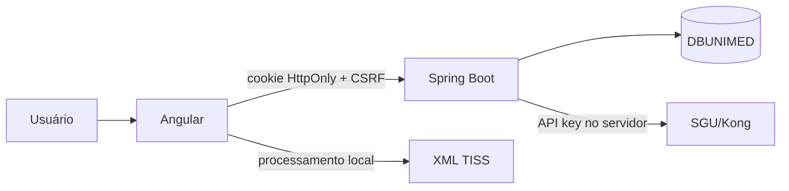

# Arquitetura do Unimed Tools

## 1. Visão geral

O Unimed Tools é composto por:

- Angular 21 no frontend;
- Spring Boot 3.3 / Java 21 no backend;
- MariaDB para identidade, permissões, auditoria e ferramentas configuráveis;
- SGU Suite/Kong como integração externa de relatórios.



## 2. Navegação

`MainLayoutComponent` fornece a navbar global.

O catálogo de navegação das ferramentas nativas está em:

`shared/constants/tools.constants.ts`

`ToolRegistryService` combina:

- ferramentas nativas;
- ferramentas configuráveis carregadas de `/api/ferramentas`;
- histórico local de ferramentas recentes.

Home e menu Ferramentas consomem a mesma fonte.

## 3. Ferramentas nativas

### Comercial

Frontend: `pages/comercial/`

Consome quatro APIs SGU existentes e resolve empresa pelo catálogo local. Não permite escolher APIs arbitrárias.

### Assistencial

Frontend: `pages/relatorios/relatorios-personalizados/`

Backend: `RelatorioPersonalizadoService`

Usa uma API reservada gerenciada pelo servidor. Colunas, filtros, ordenação e limites são validados por allowlist.

Modelos salvos no frontend não persistem os valores digitados nos filtros.


### Revisão de Contas

Frontend: `pages/xml/xml-tools/`

O processamento principal de XML ocorre no navegador. Arquivos originais não são sobrescritos.

### Única

Frontend: `pages/ans/corretor-rede/`

O backend preserva o contrato do arquivo posicional ANS e a codificação esperada.

### Hospital

Frontend: `pages/hospital/`

Backend:

- `HospitalRelatorioService`;
- endpoints `/api/relatorios/hospital/*`.

O SQL e a allowlist de filtros ficam no servidor.

**Atual:** `HospitalRelatorioService` inclui a coluna `PRESTADOR`
(`GSOL.GSOL_NOM_PROFIS`) e o filtro opcional `prestador`, com busca parcial
parametrizada e normalização de maiúsculas. O Hospital renderiza o campo pela
configuração do backend e envia o mesmo filtro na prévia e na exportação.

### Gestão de Risco

Frontend: `pages/gestao-risco/`

A tela consulta as cinco APIs pré-definidas e monta filtros a partir das definições cadastradas.

### TI

Frontend: `pages/ti/`

Reúne:

- catálogo/importação/execução de relatórios;
- grupos;
- criação de ferramentas configuráveis.

Ferramentas configuráveis são armazenadas no MariaDB e executadas pelo componente genérico `pages/tools/custom-report/`.

A apresentação das ferramentas nativas pode ser sobrescrita por
`ferramenta_nativa_configuracao`. Esse recurso altera somente nome, descrição e
visibilidade na Home/navbar. Rotas, permissões e implementação não são
configuráveis pelo navegador.

## 4. Autenticação

O fluxo é:

1. frontend solicita token CSRF;
2. usuário envia login e senha;
3. backend valida BCrypt e bloqueios;
4. backend cria token opaco aleatório;
5. somente SHA-256 do token é persistido;
6. token bruto segue em cookie `HttpOnly`;
7. cada requisição é autenticada pelo filtro de sessão;
8. Spring Security verifica a permissão exigida pelo endpoint.

Não existe etapa MFA/TOTP.

Troca e reset de senha revogam sessões existentes conforme o fluxo administrativo.

## 5. Autorização

O backend nega acesso por padrão.

Permissões operacionais principais:

- `XML_ACESSAR`;
- `BI_ACESSAR`;
- `RELATORIOS_ACESSAR`;
- `ANS_ACESSAR`.

Permissões administrativas permanecem no perfil Administrador e são validadas no backend. Criar/editar ferramentas exige `FERRAMENTAS_ADMINISTRAR`.

## 6. Persistência

MariaDB:

- usuários;
- perfis;
- permissões;
- sessões;
- auditoria;
- ferramentas configuráveis.

LocalStorage:

- catálogo/templates/grupos legados da Central;
- modelos estruturais do Assistencial;
- ferramentas recentes;
- estado local de leitura das notificações.

Nenhum token de autenticação é persistido pelo Angular.

## 7. SGU

O frontend nunca chama o SGU diretamente.

`SguRelatorioService` mantém:

- base URL;
- API key;
- nomes de headers;
- endpoints de publicação e execução.

Exportações percorrem a paginação no backend.

A paginação do SGU exige ordenação determinística. SQL importado pela Central de
Relatórios passa a receber automaticamente uma ordenação pelos aliases da
projeção principal quando isso pode ser inferido com segurança. APIs legadas
sem `ordenacao` continuam editáveis, mas uma exportação com mais de uma página
é interrompida antes de consumir a primeira página para evitar corrupção
silenciosa por repetição/omissão de registros. O backend não remove duplicidades:
linhas iguais podem ser legítimas no relatório de origem.

**Atual:** `SguRelatorioService` converte HTTP 502/503/504 em `ApiException`
com status preservado e mensagem pública, sem corpo HTML nem causa remota.
`ExportacaoRelatorioService` repete somente a consulta da página com esses erros,
uma vez após um segundo, antes de entregá-la ao escritor. Não há repetição de
publicação ou exclusão de APIs. Logs por página separam tempo de consulta e
escrita; XLSX registra também o empacotamento final. Não registram parâmetros
nem registros. Erros antes de iniciar a transmissão são devolvidos em JSON;
após transmissão parcial de CSV/TXT, o status não pode mais ser substituído.

## 8. Evolução

Para uma ferramenta nativa nova:

1. criar a página;
2. adicionar rota;
3. registrar em `CORE_TOOLS`;
4. definir permissão;
5. criar endpoint backend quando necessário;
6. testar build e autorização.

Para uma ferramenta simples baseada em API existente, prefira o construtor da área TI antes de criar código novo.

## 9. Banco e migrações

Instalação nova:

`database/DBUNIMED.sql`

Banco existente, em ordem:

- 002 — permissões por usuário;
- 003 — ferramentas configuráveis;
- 004 — remoção do MFA legado;
- 005 — configuração visual das ferramentas nativas.
- 006 — permissões das ferramentas atuais;

## 10. Validação

Frontend:

```bash
npm test -- --watch=false
npm run build
```

Backend:

```bash
mvn clean package
```

O CI executa os mesmos gates em branches `refactor/**` e em pull requests.
