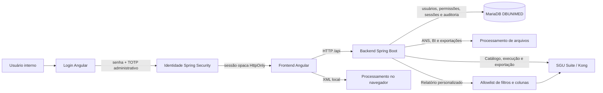
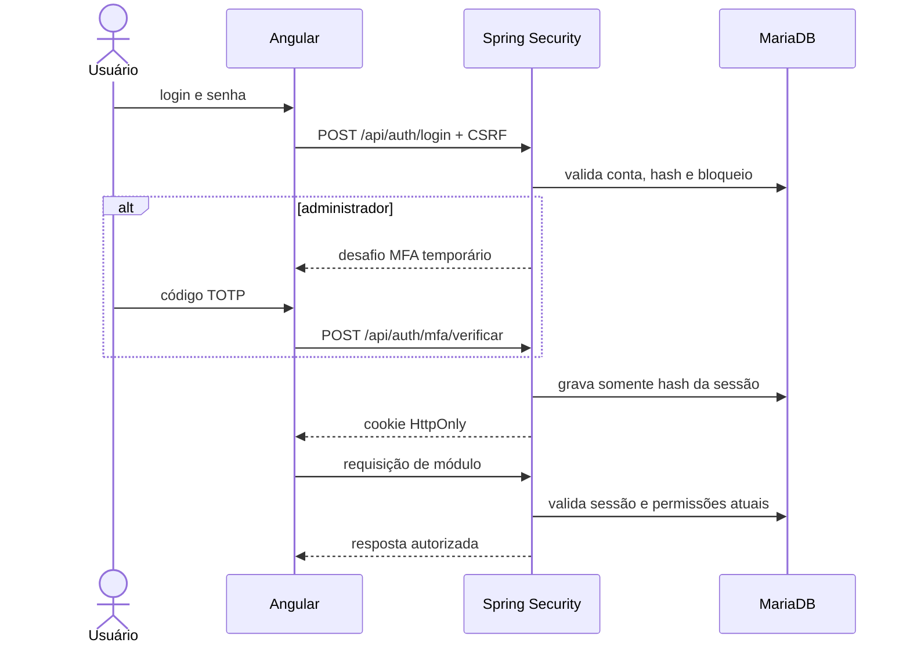
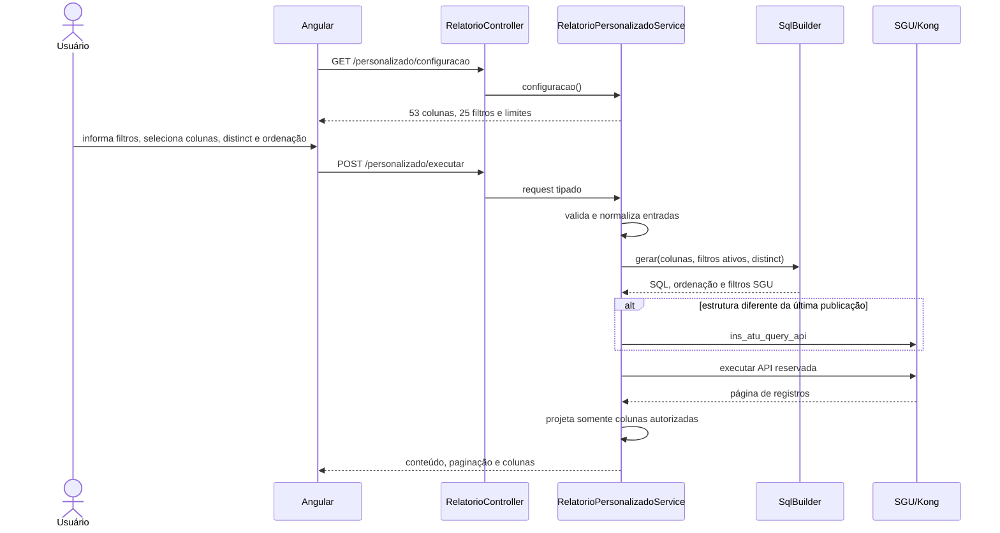
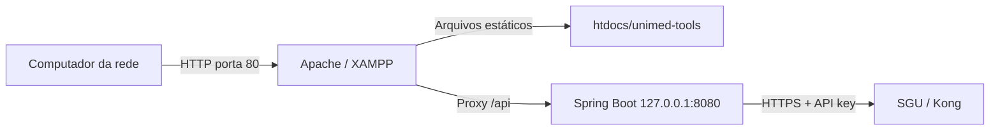

# Arquitetura do Unimed Tools

Este documento apresenta a organização técnica implementada no repositório. Requisitos e regras de negócio devem continuar sendo consultados antes de alterar qualquer fluxo.

## Visão geral

O frontend concentra interação e estado de tela. O backend recebe arquivos,
aplica regras de negócio e integra a Central de Relatórios ao SGU. O relatório
personalizado é montado exclusivamente no backend a partir de fragmentos SQL
aprovados; o Angular recebe apenas metadados de campos, filtros e limites. O
processamento XML principal permanece local no navegador; a implementação Java
existente é mantida porque sua remoção ou unificação depende de decisão
arquitetural específica.

## Identidade e acesso

**Status: Atual.** A primeira rota exibida é `/login`. O backend valida senha
com BCrypt e cria uma sessão opaca; somente o hash SHA-256 do token é persistido
em `sessao_usuario`, enquanto o navegador recebe o valor em cookie `HttpOnly`,
`SameSite=Strict` e `Secure` fora do perfil local. Requisições de escrita também
exigem o token CSRF mantido em cookie separado, sem capacidade de autenticação.

Administradores precisam configurar e validar TOTP. O segredo compartilhado é
criptografado com AES-256-GCM antes de chegar ao banco, usando
`AUTH_MFA_ENCRYPTION_KEY`. O primeiro administrador é criado por bootstrap
somente quando `usuario` está vazia; os próximos usuários são cadastrados em
`POST /api/usuarios` por uma sessão administrativa com `USUARIOS_CRIAR`.

O perfil `USUARIO` não herda permissões operacionais. As concessões individuais
ficam em `usuario_permissao` e são combinadas às permissões do perfil a cada
requisição. A interface administrativa permite somente a allowlist de módulos;
permissões de administração de usuários e dados sensíveis permanecem fora
desse fluxo. A concessão `RELATORIOS_ACESSAR` representa o acesso funcional
completo à Central de Relatórios: os mesmos endpoints protegidos por ela atendem
consulta, importação de SQL, criação, edição, execução, exportação e exclusão
de APIs no SGU.
O MFA é confirmado ao criar a sessão administrativa. Alterações de cadastro,
perfil, acesso, exclusões e redefinições de senha não pedem outro TOTP, mas
continuam exigindo sessão válida, CSRF, permissão administrativa e auditoria.
Mudanças de perfil removem concessões individuais e revogam as sessões do
usuário para que o novo nível de acesso seja aplicado imediatamente. Uma
resposta `NAO_AUTENTICADO` limpa o estado local e redireciona para `/login`.

A exclusão de usuário é uma desativação lógica. O backend marca a conta como
`INATIVO`, remove concessões e revoga sessões, mas mantém o registro necessário
para a integridade das auditorias. A própria conta administrativa e o último
administrador ativo não podem ser excluídos. A tela Angular correspondente fica
em `/usuarios/cadastrados` e o servidor continua sendo a fronteira de
autorização para todas as operações.

## Frontend

Diretório: `unimed-tools-frontend/`

| Área                         | Responsabilidade                                      |
| ---------------------------- | ----------------------------------------------------- |
| `src/app/layout/`            | Estrutura visual e navegação compartilhadas.          |
| `src/app/pages/`             | Componentes agrupados por módulo funcional.           |
| `src/app/shared/components/` | Elementos visuais reutilizáveis.                      |
| `src/app/shared/models/`     | Contratos de dados da aplicação.                      |
| `src/app/shared/services/`   | HTTP, armazenamento local e regras reutilizáveis.     |
| `src/app/shared/guards/`     | Entrada autenticada e autorização de rotas.           |
| `src/app/shared/constants/`  | Identificadores que precisam permanecer consistentes. |
| `src/app/shared/utils/`      | Funções puras e utilitários sem estado.               |
| `src/environments/`          | Endereço da API por ambiente de build.                |

As rotas utilizam carregamento sob demanda e permanecem centralizadas em `src/app/app.routes.ts`.

A rota `/relatorios` agrega quatro componentes de tela:

| Componente                       | Responsabilidade                                        |
| -------------------------------- | ------------------------------------------------------- |
| `relatorios-inicio`              | Seleção entre os modos disponíveis.                     |
| `relatorios`                     | Orquestração do modo selecionado.                       |
| `relatorios-automaticos`         | Grupos e exportações em lote.                           |
| `relatorios-personalizados`      | Filtros, colunas, prévia paginada e exportação guiada.  |

`RelatorioService` concentra a comunicação HTTP e o acesso aos catálogos do
`localStorage`. O modo personalizado não persiste filtros digitados: eles ficam
somente no estado da página atual.

**Status: Atual.** Na importação manual de SQL, o componente preserva o escopo
dos aliases de CTE. Datas literais repetidas e iguais dentro de uma CTE usam um
único bind `data_referencia`; listas vazias de empresas ou itens são convertidas
em binds de lista no mesmo bloco. O filtro registrado no SGU valida somente o
bind no `WHERE` externo, enquanto a condição efetiva permanece dentro da CTE.
Datas diferentes não são unificadas automaticamente.

**Status: Atual.** Listas literais simples com `IN` são detectadas no `WHERE`
principal e no `WHERE` de CTEs para identificadores de coluna genéricos.
Igualdades somente são convertidas para a allowlist de colunas conhecidas;
constantes técnicas como `RN = 1` e indicadores de status permanecem fixas.
Condições internas de CTE continuam no próprio bloco e recebem binds locais,
preservando o escopo dos aliases. O leitor também limita a importação à primeira
instrução terminada por ponto e vírgula fora de textos e comentários. Blocos de
comentário usados apenas como anotação depois do último token executável são
removidos antes da publicação, enquanto comentários internos são preservados.
Uma validação léxica impede o cadastro quando comentários ou aspas permanecem
sem fechamento.

**Status: Atual.** A validação anterior ao cadastro identifica aliases de tabela
duplicados dentro do mesmo bloco `SELECT`, sem impedir a reutilização em CTEs e
subconsultas independentes. Rejeições esperadas da integração SGU são devolvidas
como erro de solicitação sanitizado em vez de `500`; códigos Oracle podem ser
preservados para diagnóstico sem devolver a definição SQL ao navegador.

**Status: Atual.** Aliases de colunas projetadas também são verificados por
bloco `SELECT`. A unicidade é necessária porque a paginação do SGU envolve a
consulta em um `SELECT` externo; colunas homônimas nesse resultado provocam
`ORA-00918` durante a execução, embora o cadastro da definição seja aceito.

**Status: Atual.** Na fronteira de cadastro manual, nomes de filtro com underscore
ou hífen são compactados para caracteres alfanuméricos. A mesma substituição é
aplicada aos binds do SQL-base e de `conteudoFiltro`, mantendo a correspondência
exigida pelo SGU e a sintaxe válida do Oracle. Identificadores internos continuam
legíveis e colisões produzidas pela compactação são rejeitadas localmente.

**Status: Atual.** `NotificationService` expõe o histórico estático de versões
do frontend e persiste no `localStorage` apenas os identificadores já lidos. O
painel fica no cabeçalho do `main-layout`; não armazena dados de autenticação nem
depende do backend.

**Status: Atual.** O utilitário compartilhado `report-preview.utils` reconhece
aliases de Nome e CPF do beneficiário, inclusive nomes legados como
`PES_NOM_COMP`, `NM_PACIENTE`, `BENEFICIARIO`, `NOME_COMP` e `NOME_COMPLETO`, e
devolve uma máscara para as tabelas de prévia Manual e Personalizada. A
identificação ocorre durante a renderização, inclusive para relatórios manuais
já cadastrados. Os
registros originais permanecem no fluxo de exportação. O modo Automático não
possui prévia tabular de registros e gera os arquivos diretamente.

## Backend

Diretório: `unimed-tools-backend/`

| Pacote       | Responsabilidade                              |
| ------------ | --------------------------------------------- |
| `config`     | Configurações transversais, como CORS.        |
| `controller` | Contratos HTTP e montagem das respostas.      |
| `dto`        | Objetos de entrada, saída e estatísticas.     |
| `exception`  | Tratamento uniforme de erros.                 |
| `service`    | Regras de negócio, arquivos e integração SGU. |
| `auth`       | Senhas, MFA, sessões, usuários e auditoria.    |

Controllers não devem incorporar parsing de arquivos ou regras de negócio. Services não devem conhecer detalhes visuais do frontend.

### Componentes do relatório personalizado

**Status: Atual.**

| Componente                            | Responsabilidade                                                       |
| ------------------------------------- | ---------------------------------------------------------------------- |
| `RelatorioController`                 | Expõe configuração, execução e exportação e protege a API reservada.   |
| `RelatorioPersonalizadoRequest`       | Contrato de colunas, filtros, `distinct`, ordenação, paginação e arquivo. |
| `RelatorioPersonalizadoService`       | Valida entradas, coordena publicação/execução e projeta a resposta.    |
| `RelatorioPersonalizadoSqlBuilder`    | Mantém a allowlist e monta SQL somente com fragmentos aprovados.       |
| `SguRelatorioService`                 | Envia a definição e os parâmetros ao SGU sem expor a chave ao cliente. |
| `ExportacaoRelatorioService`          | Percorre páginas, infere tipos e gera ou transmite CSV, TXT e XLSX.     |
| `RelatorioAsyncConfig`                | Limita concorrência e timeout das respostas manuais de longa duração.  |

**Status: Atual.** A paginação da exportação termina pela indicação `last`, por
um lote vazio ou menor que o solicitado. `SGU_EXPORT_MAX_PAGES=0` não impõe um
teto fixo, mas a repetição da mesma página continua sendo rejeitada para impedir
laços sem fim. O serviço remove a coluna técnica `RNUM` antes de gerar qualquer
formato, inclusive os arquivos do ZIP automático. Manual e Personalizado exibem
progresso estimado enquanto o backend processa e progresso de transferência
quando o navegador recebe tamanho total da resposta.

Na exportação Manual, a resposta usa processamento assíncrono e o serviço
mantém somente o lote corrente em memória. CSV e TXT são enviados a cada página;
XLSX usa `SXSSFWorkbook`, conserva uma janela de linhas em memória e escreve o
arquivo diretamente na resposta. Como o total só é conhecido depois que os
headers já foram enviados, esse endpoint não inclui `X-Total-Registros`; o
relatório Personalizado preserva o header no contrato atual.

CSV e TXT compartilham o contrato textual delimitado por `;`, incluindo escape
de campos que contenham o próprio separador. XLSX representa a mesma separação
por células e colunas, pois o formato de planilha não utiliza delimitador textual.

Como o frontend funciona em modo zoneless, os componentes dos modos Manual,
Personalizado e Automático solicitam explicitamente a detecção de mudanças ao
concluir callbacks HTTP, temporizadores e continuações assíncronas. Isso inclui
as rotinas administrativas das APIs e a leitura de mensagens de erro em `Blob`.

A API `0090-relatorio-personalizado` é reservada ao construtor. Ela é ocultada
da listagem do catálogo manual e os endpoints genéricos impedem sua criação,
execução, exportação e exclusão direta.

### Fluxo do relatório personalizado

Na exportação, o mesmo lock permanece adquirido enquanto todas as páginas são
carregadas. Isso impede que outra requisição na mesma JVM substitua a definição
da API entre páginas. A definição mais recente fica em cache na memória do
processo e só é republicada quando mudam as colunas ou os filtros ativos.

### Contratos e limites

- fonte atual: **Despesas, receita e sinistralidade**;
- 53 colunas autorizadas, com rótulo, grupo, seleção padrão e indicador de
  sensibilidade;
- 25 filtros autorizados; competências inicial e final são obrigatórias;
- o filtro de código da empresa aceita uma lista de inteiros separados por
  vírgula; o backend normaliza a lista e o SQL compara cada valor por meio de um
  único bind `VARCHAR`, sem interpolação de entrada do usuário;
- o filtro `id_guia` consulta `GUIA.GUIA_COD_ID` e aceita uma lista de inteiros
  separados por vírgula; `numero_guia` permanece associado a `GUIA.GUIA_COD`,
  preservando a distinção entre a chave interna e o número cadastrado;
- `NOME_PESSOA_EMPRESA` resolve `PESSOA.PES_NOM_COMP` pelo vínculo
  `EMP_CONTRT.EMPCN_COD_PESSOA`, mantendo `NOME_EMPRESA` compatível com as
  regras históricas de intercâmbio e pessoa física;
- o filtro opcional de grupo do beneficiário aceita `GRBNF_COD` ou parte da
  descrição, sem utilizar o campo técnico `ID`; a associação entre
  `GRUPO_BNFRIO_ITEM` e `GRUPO_BNFRIO` é
  agregada pelas quatro partes da chave do beneficiário e comparada diretamente
  com as quatro colunas correspondentes de `GUIA`; o vínculo é incluído somente
  quando o filtro está ativo, evitando duplicar linhas e sem depender de
  `BNFRIO` para reconhecer a associação ao grupo;
- seleções compostas somente por colunas dos grupos **Beneficiário** e
  **Valores** são agregadas automaticamente pela identidade técnica do
  beneficiário, com `SUM` nas colunas de valores; qualquer coluna de contrato,
  prestador, guia ou procedimento mantém a granularidade por item;
- Receita e Sinistralidade usam CTEs financeiras que consolidam separadamente
  despesas de guia, mensalidades, coparticipações e itens de fatura sem
  movimento antes da união; a Sinistralidade aplica
  `(despesa - coparticipação positiva) / mensalidade * 100` e os dois
  indicadores só aceitam dimensões e filtros de beneficiário, contrato,
  empresa e competência para evitar cruzamentos de granularidade;
- intervalo máximo de 12 meses;
- prévia de 1 a 100 linhas por página;
- filtros desconhecidos, repetidos ou maiores que 240 caracteres são rejeitados;
- IDs internos aceitam underscore e, por compatibilidade, hífen;
- na fronteira SGU, nomes e binds são compactados para caracteres alfanuméricos;
- `distinct=true` aplica `SELECT DISTINCT` somente à projeção externa autorizada
  e ordena pelas próprias colunas projetadas para preservar compatibilidade com
  o Oracle;
- a resposta e a exportação contêm apenas as colunas solicitadas e validadas;
- a ordenação explícita usa somente o alias projetado e `ASC` ou `DESC`, sem
  critérios técnicos adicionais, por compatibilidade com o limite interno da
  rotina `ins_atu_query_api` do SGU;
- a ordem das colunas enviada pelo Angular é preservada pelo backend na prévia e
  na exportação;
- a coluna clicada na prévia e a direção `ASC` ou `DESC` são validadas contra a
  seleção e aplicadas no backend a todas as páginas e à exportação;
- a prévia apresenta o total informado pelo SGU em `totalElements` ou
  `numberOfElements`; quando nenhum total é recebido, a interface deixa a
  indisponibilidade explícita em vez de manter um cálculo indefinido;
- a exportação devolve a quantidade materializada no header CORS
  `X-Total-Registros`;
- o XLSX grava datas, números e textos em células tipadas; identificadores são
  preservados como texto, enquanto CSV e TXT recebem representação compatível
  com a importação no Excel sem alterar sua natureza textual;
- SQL, aliases técnicos e `SGU_API_KEY` não são enviados ao navegador.

Nos três modos de relatório, o frontend mantém uma camada de bloqueio sobre a
área de trabalho enquanto uma consulta ou exportação está ativa. Somente o
comando de voltar/trocar de modo fica acima dessa camada. No modo Automático, a
barra existe apenas durante a requisição; a conclusão é comunicada por uma
notificação transitória de sucesso ou erro.

Os endpoints específicos são:

| Método | Endpoint                                             | Responsabilidade                   |
| ------ | ---------------------------------------------------- | ---------------------------------- |
| GET    | `/api/relatorios/personalizado/configuracao`         | Catálogo seguro para montar a tela |
| POST   | `/api/relatorios/personalizado/executar`              | Prévia paginada                    |
| POST   | `/api/relatorios/personalizado/exportar?formato=...`  | Exportação completa                |

## Estado e persistência

- Catálogo, templates e grupos de relatórios permanecem no `localStorage`.
- O estado de leitura das notificações também fica no `localStorage` e contém
  somente identificadores públicos das versões.
- As chaves são centralizadas e versionadas; qualquer mudança exige migração explícita.
- Filtros do relatório personalizado não são persistidos; o catálogo autorizado vem do backend.
- O cache da última definição personalizada publicada existe apenas na memória da instância Spring Boot.
- Usuários, perfis, permissões, desafios, sessões e auditorias ficam no MariaDB.
- O backend usa JDBC parametrizado e não introduz JPA nos catálogos existentes.
- Token de sessão, senha e segredo TOTP nunca são persistidos em claro.
- O estado de autenticação do Angular fica apenas em memória; o cookie de sessão
  não é acessível pelo JavaScript.

## Implantação local em rede

**Status: Atual.**

O build `lan` do Angular usa base `/unimed-tools/` e API relativa `/api`. No
XAMPP, o Apache serve somente os artefatos compilados e atua como proxy reverso
para o Spring Boot restrito a `127.0.0.1:8080`.

O código-fonte não deve ser copiado para `htdocs`. O fluxo de atualização é:

1. alterar e testar o projeto em `unimed-tools-frontend/`;
2. executar `npm run build:lan`;
3. copiar somente `dist/unimed-tools-frontend/browser/` para o diretório público;
4. manter `.htaccess` para o fallback das rotas Angular.

Essa topologia mantém a porta Java restrita e agora inclui autenticação. Como há
tráfego de credenciais e sessão, o Apache deve publicar a aplicação por HTTPS
com certificado aprovado, sem desativar a validação TLS.

## Limites arquiteturais conhecidos

- Fechamento possui interface, mas não possui implementação no backend.
- O módulo BI usa `XSSFWorkbook`; seleção de CSV na interface não comprova suporte funcional a CSV.
- O SGU/Kong pode bloquear o ambiente hospedado com HTTP 403 por regras externas de rede.
- A API personalizada é compartilhada e o lock coordena apenas threads da mesma JVM; múltiplas réplicas exigem coordenação distribuída.
- O indicador de coluna sensível orienta a interface, mas não substitui a
  autorização já aplicada pelo backend; as exportações continuam exigindo a
  permissão do módulo e podem conter os valores originais autorizados.
- Uploads grandes são limitados a 100 MB e exigem atenção ao consumo de memória.
- Serviços XML em TypeScript e Java não devem ser fundidos ou removidos incidentalmente.
- Recuperação de senha e recuperação de MFA ainda não possuem fluxo próprio;
  dependem de procedimento administrativo futuro e aprovado.
- A chave de criptografia MFA precisa permanecer disponível e protegida durante
  todo o ciclo de vida; perdê-la impede validar os segredos TOTP existentes.

## Como evoluir a estrutura

1. Preserve rotas, endpoints, campos e formatos já consumidos.
2. Extraia código reutilizável para `shared` somente quando houver mais de um consumidor real.
3. Mantenha tipos específicos junto do domínio; mova-os para modelos compartilhados apenas quando atravessarem módulos.
4. Adicione testes antes de alterar parsers posicionais, SQL, XML ou paginação do SGU.
5. Atualize este documento e o `README.md` quando uma fronteira arquitetural mudar.
6. Preserve a allowlist do relatório personalizado; novos campos exigem expressão SQL aprovada, classificação de sensibilidade e testes.
