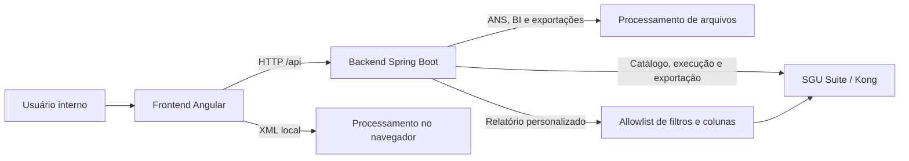
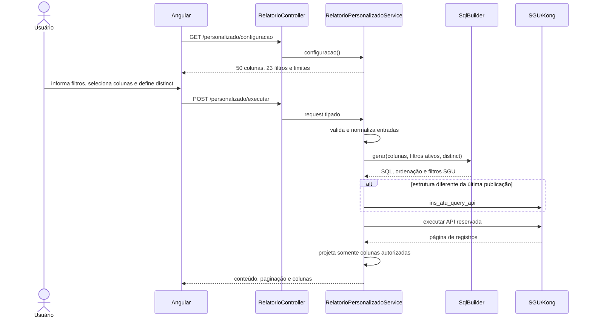
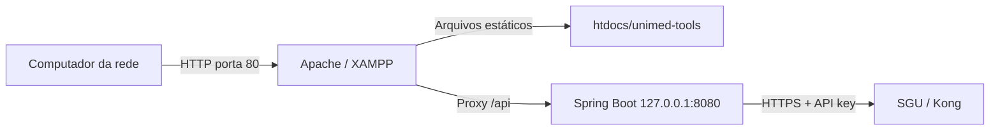

# Arquitetura do Unimed Tools

Este documento apresenta a organização técnica implementada no repositório. Requisitos e regras de negócio devem continuar sendo consultados antes de alterar qualquer fluxo.

## Visão geral

O frontend concentra interação e estado de tela. O backend recebe arquivos,
aplica regras de negócio e integra a Central de Relatórios ao SGU. O relatório
personalizado é montado exclusivamente no backend a partir de fragmentos SQL
aprovados; o Angular recebe apenas metadados de campos, filtros e limites. O
processamento XML principal permanece local no navegador; a implementação Java
existente é mantida porque sua remoção ou unificação depende de decisão
arquitetural específica.

## Frontend

Diretório: `unimed-tools-frontend/`

| Área                         | Responsabilidade                                      |
| ---------------------------- | ----------------------------------------------------- |
| `src/app/layout/`            | Estrutura visual e navegação compartilhadas.          |
| `src/app/pages/`             | Componentes agrupados por módulo funcional.           |
| `src/app/shared/components/` | Elementos visuais reutilizáveis.                      |
| `src/app/shared/models/`     | Contratos de dados da aplicação.                      |
| `src/app/shared/services/`   | HTTP, armazenamento local e regras reutilizáveis.     |
| `src/app/shared/constants/`  | Identificadores que precisam permanecer consistentes. |
| `src/app/shared/utils/`      | Funções puras e utilitários sem estado.               |
| `src/environments/`          | Endereço da API por ambiente de build.                |

As rotas utilizam carregamento sob demanda e permanecem centralizadas em `src/app/app.routes.ts`.

A rota `/relatorios` agrega quatro componentes de tela:

| Componente                       | Responsabilidade                                        |
| -------------------------------- | ------------------------------------------------------- |
| `relatorios-inicio`              | Seleção entre os modos disponíveis.                     |
| `relatorios`                     | Orquestração do modo selecionado.                       |
| `relatorios-automaticos`         | Grupos e exportações em lote.                           |
| `relatorios-personalizados`      | Filtros, colunas, prévia paginada e exportação guiada.  |

`RelatorioService` concentra a comunicação HTTP e o acesso aos catálogos do
`localStorage`. O modo personalizado não persiste filtros digitados: eles ficam
somente no estado da página atual.

## Backend

Diretório: `unimed-tools-backend/`

| Pacote       | Responsabilidade                              |
| ------------ | --------------------------------------------- |
| `config`     | Configurações transversais, como CORS.        |
| `controller` | Contratos HTTP e montagem das respostas.      |
| `dto`        | Objetos de entrada, saída e estatísticas.     |
| `exception`  | Tratamento uniforme de erros.                 |
| `service`    | Regras de negócio, arquivos e integração SGU. |

Controllers não devem incorporar parsing de arquivos ou regras de negócio. Services não devem conhecer detalhes visuais do frontend.

### Componentes do relatório personalizado

**Status: Atual.**

| Componente                            | Responsabilidade                                                       |
| ------------------------------------- | ---------------------------------------------------------------------- |
| `RelatorioController`                 | Expõe configuração, execução e exportação e protege a API reservada.   |
| `RelatorioPersonalizadoRequest`       | Contrato de colunas, filtros, `distinct`, paginação e nome do arquivo. |
| `RelatorioPersonalizadoService`       | Valida entradas, coordena publicação/execução e projeta a resposta.    |
| `RelatorioPersonalizadoSqlBuilder`    | Mantém a allowlist e monta SQL somente com fragmentos aprovados.       |
| `SguRelatorioService`                 | Envia a definição e os parâmetros ao SGU sem expor a chave ao cliente. |
| `ExportacaoRelatorioService`          | Percorre páginas, infere tipos e gera CSV, TXT ou XLSX.                 |

A API `0090-relatorio-personalizado` é reservada ao construtor. Ela é ocultada
da listagem do catálogo manual e os endpoints genéricos impedem sua criação,
execução, exportação e exclusão direta.

### Fluxo do relatório personalizado

Na exportação, o mesmo lock permanece adquirido enquanto todas as páginas são
carregadas. Isso impede que outra requisição na mesma JVM substitua a definição
da API entre páginas. A definição mais recente fica em cache na memória do
processo e só é republicada quando mudam as colunas ou os filtros ativos.

### Contratos e limites

- fonte atual: **Despesas por item de guia**;
- 50 colunas autorizadas, com rótulo, grupo, seleção padrão e indicador de
  sensibilidade;
- 23 filtros autorizados; competências inicial e final são obrigatórias;
- intervalo máximo de 12 meses;
- prévia de 1 a 100 linhas por página;
- filtros desconhecidos, repetidos ou maiores que 240 caracteres são rejeitados;
- IDs internos aceitam underscore e, por compatibilidade, hífen;
- na fronteira SGU, nomes e binds são compactados para caracteres alfanuméricos;
- `distinct=true` aplica `SELECT DISTINCT` somente à projeção externa autorizada
  e ordena pelas próprias colunas projetadas para preservar compatibilidade com
  o Oracle;
- a resposta e a exportação contêm apenas as colunas solicitadas e validadas;
- a prévia apresenta o total informado pelo SGU e a exportação devolve a
  quantidade materializada no header CORS `X-Total-Registros`;
- o XLSX grava datas, números e textos em células tipadas; identificadores são
  preservados como texto, enquanto CSV e TXT recebem representação compatível
  com a importação no Excel sem alterar sua natureza textual;
- SQL, aliases técnicos e `SGU_API_KEY` não são enviados ao navegador.

Os endpoints específicos são:

| Método | Endpoint                                             | Responsabilidade                   |
| ------ | ---------------------------------------------------- | ---------------------------------- |
| GET    | `/api/relatorios/personalizado/configuracao`         | Catálogo seguro para montar a tela |
| POST   | `/api/relatorios/personalizado/executar`              | Prévia paginada                    |
| POST   | `/api/relatorios/personalizado/exportar?formato=...`  | Exportação completa                |

## Estado e persistência

- Catálogo, templates e grupos de relatórios permanecem no `localStorage`.
- As chaves são centralizadas e versionadas; qualquer mudança exige migração explícita.
- Filtros do relatório personalizado não são persistidos; o catálogo autorizado vem do backend.
- O cache da última definição personalizada publicada existe apenas na memória da instância Spring Boot.
- O backend atual não possui banco de dados ou entidades JPA.
- O projeto não possui autenticação própria no estado atual.

## Implantação local em rede

**Status: Atual.**

O build `lan` do Angular usa base `/unimed-tools/` e API relativa `/api`. No
XAMPP, o Apache serve somente os artefatos compilados e atua como proxy reverso
para o Spring Boot restrito a `127.0.0.1:8080`.

O código-fonte não deve ser copiado para `htdocs`. O fluxo de atualização é:

1. alterar e testar o projeto em `unimed-tools-frontend/`;
2. executar `npm run build:lan`;
3. copiar somente `dist/unimed-tools-frontend/browser/` para o diretório público;
4. manter `.htaccess` para o fallback das rotas Angular.

Essa topologia reduz a exposição da porta Java, mas não adiciona autenticação.
O acesso deve permanecer limitado à rede corporativa ou a outro controle de
acesso aprovado.

## Limites arquiteturais conhecidos

- Fechamento possui interface, mas não possui implementação no backend.
- O módulo BI usa `XSSFWorkbook`; seleção de CSV na interface não comprova suporte funcional a CSV.
- O SGU/Kong pode bloquear o ambiente hospedado com HTTP 403 por regras externas de rede.
- A API personalizada é compartilhada e o lock coordena apenas threads da mesma JVM; múltiplas réplicas exigem coordenação distribuída.
- O indicador de coluna sensível orienta a interface, mas não substitui autorização, pois a aplicação ainda não possui login próprio.
- Uploads grandes são limitados a 100 MB e exigem atenção ao consumo de memória.
- Serviços XML em TypeScript e Java não devem ser fundidos ou removidos incidentalmente.

## Como evoluir a estrutura

1. Preserve rotas, endpoints, campos e formatos já consumidos.
2. Extraia código reutilizável para `shared` somente quando houver mais de um consumidor real.
3. Mantenha tipos específicos junto do domínio; mova-os para modelos compartilhados apenas quando atravessarem módulos.
4. Adicione testes antes de alterar parsers posicionais, SQL, XML ou paginação do SGU.
5. Atualize este documento e o `README.md` quando uma fronteira arquitetural mudar.
6. Preserve a allowlist do relatório personalizado; novos campos exigem expressão SQL aprovada, classificação de sensibilidade e testes.
