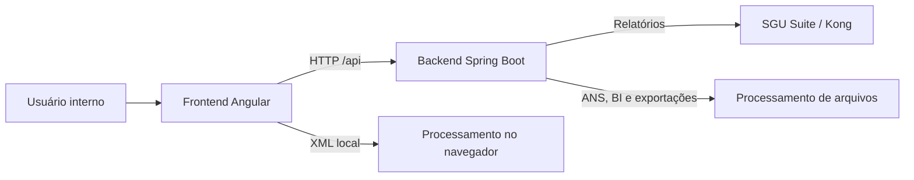

# Arquitetura do Unimed Tools

Este documento apresenta a organização técnica implementada no repositório. Requisitos e regras de negócio devem continuar sendo consultados antes de alterar qualquer fluxo.

## Visão geral

O frontend concentra interação e estado de tela. O backend recebe arquivos, aplica regras de negócio e integra a Central de Relatórios ao SGU. O processamento XML principal permanece local no navegador; a implementação Java existente é mantida porque sua remoção ou unificação depende de decisão arquitetural específica.

## Frontend

Diretório: `unimed-tools-frontend/`

| Área                         | Responsabilidade                                      |
| ---------------------------- | ----------------------------------------------------- |
| `src/app/layout/`            | Estrutura visual e navegação compartilhadas.          |
| `src/app/pages/`             | Componentes agrupados por módulo funcional.           |
| `src/app/shared/components/` | Elementos visuais reutilizáveis.                      |
| `src/app/shared/models/`     | Contratos de dados da aplicação.                      |
| `src/app/shared/services/`   | HTTP, armazenamento local e regras reutilizáveis.     |
| `src/app/shared/constants/`  | Identificadores que precisam permanecer consistentes. |
| `src/app/shared/utils/`      | Funções puras e utilitários sem estado.               |
| `src/environments/`          | Endereço da API por ambiente de build.                |

As rotas utilizam carregamento sob demanda e permanecem centralizadas em `src/app/app.routes.ts`.

## Backend

Diretório: `unimed-tools-backend/`

| Pacote       | Responsabilidade                              |
| ------------ | --------------------------------------------- |
| `config`     | Configurações transversais, como CORS.        |
| `controller` | Contratos HTTP e montagem das respostas.      |
| `dto`        | Objetos de entrada, saída e estatísticas.     |
| `exception`  | Tratamento uniforme de erros.                 |
| `service`    | Regras de negócio, arquivos e integração SGU. |

Controllers não devem incorporar parsing de arquivos ou regras de negócio. Services não devem conhecer detalhes visuais do frontend.

## Estado e persistência

- Catálogo, templates e grupos de relatórios permanecem no `localStorage`.
- As chaves são centralizadas e versionadas; qualquer mudança exige migração explícita.
- O backend atual não possui banco de dados ou entidades JPA.
- O projeto não possui autenticação própria no estado atual.

## Limites arquiteturais conhecidos

- Fechamento possui interface, mas não possui implementação no backend.
- O módulo BI usa `XSSFWorkbook`; seleção de CSV na interface não comprova suporte funcional a CSV.
- O SGU/Kong pode bloquear o ambiente hospedado com HTTP 403 por regras externas de rede.
- Uploads grandes são limitados a 100 MB e exigem atenção ao consumo de memória.
- Serviços XML em TypeScript e Java não devem ser fundidos ou removidos incidentalmente.

## Como evoluir a estrutura

1. Preserve rotas, endpoints, campos e formatos já consumidos.
2. Extraia código reutilizável para `shared` somente quando houver mais de um consumidor real.
3. Mantenha tipos específicos junto do domínio; mova-os para modelos compartilhados apenas quando atravessarem módulos.
4. Adicione testes antes de alterar parsers posicionais, SQL, XML ou paginação do SGU.
5. Atualize este documento e o `README.md` quando uma fronteira arquitetural mudar.
